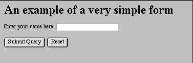
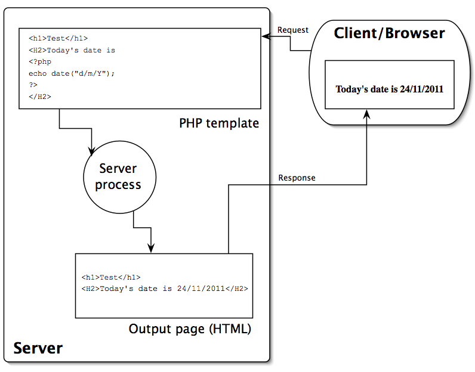

-   [Introduction](#introduction)
-   [The role of the server](#the-role-of-the-server)
-   [CGI](#cgi)
-   [The HTTP request methods](#the-http-request-methods)
-   [Forms](#forms)
-   [The processing script](#the-processing-script)
-   [PHP](#php)
-   [Today's date is 11/01/2019](#todays-date-is-11012019)
-   [The Fat-Free Framework (F3)](#the-fat-free-framework-f3)
    -   [Routes](#routes)
    -   [Templates](#templates)
    -   [Forms in F3](#forms-in-f3)
    -   [The GET object](#the-get-object)
    -   [The PARAMS object](#the-params-object)

## Introduction

Dynamic web sites are everywhere. Very few are static HTML pages. E-commerce systems are dynamic; catalogues, searches, registration/login systems, shopping baskets, message boards, surveys, systems with cookies, RSS feeds -- all these are dynamic. We need to understand how to create and control them for ourselves.

Dynamic web sites are all about change: change not just in the way information is displayed (which we can achieve in the browser with Javascript, Flash, etc.), but change in the information itself. Information may be dynamically substituted with other information, or dynamically created from some other resource. This can only be done at the source of the information: the web server.

So in this course, we begin by turning our focus away from the web user's browser for a while, to consider the role of the web _server_ in an interaction, and how we can use this to provide for different kinds of functionality. In particular, we look at how information can be obtained from the user by means of *form-filling*, and we begin to look at how it can be processed once we've got it.

We develop this line of discussion by starting to look at the use of *databases* and how they can be integrated to provide dynamic information through web sites. These are the techniques and technologies used by most commercial web sites, and this course should equip you to understand how these are created, and develop sites of these kinds for yourself. We will start by considering the simplest kinds of web technologies and then move on to look at a system called PHP, which we will use in this course as our choice from a range of possible technologies with similar capabilities.

As ever in the Design and Digital Media (or Digital Media Design) programme, we are not aiming to do more in the lectures than introduce these things: it is up to you to pursue further resources to find more information and move to a more advanced level.

## The role of the server

When you look at a web page, what actually happens is that your browser connects to a server, specified in the first part of the URL, and sends the server a _request_, which includes the whole URL. The server provides (i.e. _serves_) a specific document, specified by the rest of the URL.

The document (which is usually just a file full of some kind of data) is downloaded onto your machine, and the browser identifies its ***type***, usually through information in a "header" sent by the server (see below), which normally relates to the file extension, ".html" etc. (but the header often takes precedence if the file extension is different). If it's HTML, or plain text, or a few other things, the browser will attempt to display it using its own resources; or it may offer it as input to a plugin; otherwise it may launch a helper application or just save the file somewhere. (Usually browser "preferences" determine how various kinds of document are handled; see also <http://en.wikipedia.org/wiki/Internet_media_type>.)

Sometimes, the document requested by the browser does not already exist on the server machine, at least not in the required form. In that case, the request may fail, but alternatively the server may have been given instructions to do some processing to create or modify the document before serving it.

The HyperText Transfer Protocol (HTTP), which web applications typically use to communicate, is how requests are expressed when the URL begins with "http:", and it allows one to specify some aspects of how the server should behave.

## CGI

The "Common Gateway Interface" is a standard mechanism whereby the server can be made to execute some application on the server machine, and provide any result from the application as data to be sent back to the originator of the request.

The server will execute the application; it will also pass as a **_parameter_** to the application any component of the URL that follows a "**?**" character. Thus, if you visit the Google search site (<http://www.google.com/>) and execute a search for _MSc Design Digital Media_, you'll notice that the URL in the browser changes to something like the following (roughly, though the details may differ at different times and places):

`http://www.google.com/search?hl=en&q=MSc+Design+Digital+Media&btnG=Google+Search`

In this URL, _search,_ just before the "_?_",  will be the name of some application on the Google server machine, and the string _hl=en&q=MSc+Design+Digital+Media&btnG=Google+Search_ is what's handed to it as a parameter.

By convention, this parameter string (often called the "*query string*") consists of a list of named parameters (in this case three: _h1, q,_ and `btnG`) and their values, linked by "=". The parameter-value pairs are separated by "&". Within parameter values, words are separated with the "+" character.

Spaces are not allowed: any such non-alphanumeric characters are represented by "%" and then their ASCII code as a two-digit hexadecimal number, so if spaces do appear they are encoded as "%20". (Because the ASCII code for a space is 32 in decimal, 20 in hex. This arrangement is called _URL encoding_, and has to be used in all URLs, though most browsers now will silently encode URLs before sending them if you just type them in directly.)

## The HTTP request methods

When a request is sent to a server, a **`method`** is specified for handling any data associated with the request. Usually, this is either GET or POST. The former of these is notionally associated with getting information from the server, while the latter is associated with posting data to it; however these are often not very distinct. Either way, some facility is available for the server to obtain information from the browser, which may then be somehow processed (and then probably other information will be sent back as a response).

In the case of *forms*, the browser is in fact providing data to the server, but it can do this using either GET or POST methods -- the information is simply sent in different ways. We will normally use the POST method for form data, because it has some security advantages.

## Forms

HTML forms are, at their simplest, just a quick and convenient way of adding information to an HTTP request. For example, they can be used to construct a query string for a CGI URL.

Suppose we have an application on our server that saves people's names in a file, and the application is called _namesave.cgi_. If one executes it with a name as parameter, it will add the name to a file. We could have the user always type in a URL ending with `.../namesave.cgi?name=John+Smith`
(or whatever their name might be), but this is not at all convenient. Usually the user would be put off by this, and it is more practical, as well as more attractive and simpler, to provide instead an HTML form as follows.

```html
<html>
<head>
    <title>Simple example form</title>
</head>
<body>
<h1>An example of a very simple form</h1>
<p>
<form method="GET" action="namesave.cgi"> Enter your name here: 
    <input type="text" name="name">
    <input type="submit">
    <input type="reset">
</form>
</body>
</html>
```
When this HTML is displayed, it looks as follows ([or as at this link](https://jlee.edinburgh.domains/test/verysimpleform.html)):



And when the Submit button is clicked, the URL changes to the one shown above, i.e. it ends in _namesave.cgi_ (and what comes before that depends on the URL of the form itself, because in the HTML of the form _action_ attribute we have used a _relative link --_ relative and absolute links work in forms just the same way as anywhere else). 
**NB, the application in this example is no longer there, so you'll get a "not found" message when you try to execute it, but you can still see what happens to the URL.**

This principle can be extended, in that there are a considerable range of types of input available (lists, buttons, checkboxes, etc.), and clearly the URL produced can become very complicated, but the mechanism remains the same.

Editors can make the creation of forms very simple. The trickier part comes when you want to do something with the data they create. The basic mechanism is fairly simple: the "form" tag specifies through its "action" attribute a CGI application that will be used by the server to process the form data, and the method (GET or POST) will be as specified by the "method" attribute:

```html
<form method="GET" action="namesave.cgi">
```

All you need to do, then, is decide what application to use and create a program that handles the data appropriately.

The most obvious difference between GET and POST, in practice, is that whereas the GET method sends parameters via the URL as described above, POST causes the information to be sent in a different way, which is not visible on the URL. We have chosen to use GET here for clarity, but obviously POST may have advantages in many situations. The application that processes the data will also have to decode it differently depending on which of these methods is used, and decoding POST information may be more complicated. (With PHP, as we'll see below, it's much the same in practice: we normally use POST for form data, but we will not need to know the details of how PHP decodes it.)

Remember that the URL query string can be used even without forms, to provide information for an application. This will continue to be important for us.

We are concerned here only with the "back-end" processing of form data, but the appearance and behaviour of the form for the user is of course also very important. HTML5 provides many useful features in this respect and is now the best choice for form development (see the Forms chapter in the excellent _Dive into HTML5_ for explanation and examples \--- <http://diveintohtml5.info/forms.html>).

## The processing script

The application program you create to handle form data could be almost anything that can be run on the server machine. You could write it in C, Java, Prolog, Applescript, Visual Basic or various other things that might be available. The key factor is that the server runs the application in an _environment_ where it is provided with the values for various variables as part of the CGI interface, which includes the query string, along with things like the user's IP number, the kind of browser they're using, etc.

Often, however, form data is processed by some system that is more integrated with the task of producing HTML pages from other data. Such systems are PHP, ASP, JSP, Coldfusion, and others. These can all be used for a range of CGI-related purposes. We are going to use PHP, which is just one example. You are welcome to look at and compare the others if you want. (PHP can be used on our own server -- details follow. ASP is normally available only on Windows-based servers, but the others are supported on various platforms.)

What happens with all of these systems is that you write _templates_, which are HTML pages that have instructions of some kind embedded in them. The server processes the template by removing the instructions and replacing them with more HTML that the instructions tell it how to create, often using data or other resources that may be different at different times. Hence the final page that the user sees is created _dynamically_ just at the moment it is asked for, and so it can be updated in many ways that would be impossible with a static page.

## PHP

We have chosen PHP mainly because it is free, open source software and very widely used. It is also extremely powerful. Its development history is well described at <http://uk.php.net/manual/en/history.php>. It has a comprehensive manual, as well as tutorials and other material, on its own web site at <http://uk.php.net/docs.php>. It is also well integrated with Dreamweaver for editing and design purposes.

You can install PHP on your own computer (e.g. laptop), along with the MySQL database and the Apache web server, in the form of a neatly packaged setup called (if you are using a Macintosh) MAMP ([www.mamp.info/](http://www.mamp.info/)). This stands for "Macintosh, Apache, MySQL, PHP", and derives from the original LAMP, which is for the Linux operating system. There is also WAMP or WampServer for Windows machines. We do not undertake to support students in running any setup on their own machines: if you wish to try it, this is up to you. We provide access to all the components via the _Edinburgh Domains_ service, as described [at this link](additional.html).

PHP defines a language written between tags that are placed within HTML pages (or in files that have no HTML, which function simply as PHP scripts). The tags open with `<?php`, and close with `?>`; they are embedded in ordinary HTML pages that are placed on a machine with a special PHP web server (which is often an extension of the server that serves plain HTML web pages). These pages are sometimes known as _templates_. When they are served by the server, _all the PHP code, with its tags, disappears_ and is replaced by pieces of HTML that depend on what the PHP statements specified. The resulting page is therefore interpretable by any normal browser. If you look at the HTML source of any PHP page as it arrives at your browser, you will find nothing other than ordinary HTML, CSS, perhaps javascript etc. -- no trace of PHP code. With this kind of system, the pages can be designed exactly as usual, but with these PHP tags as placeholders for material that will be provided dynamically when the page is viewed in the user's browser.

So there is no PHP user interface: you design your page templates using any text editor, and you include PHP script elements into the HTML. [Adobe Dreamweaver](https://www.adobe.com/uk/products/dreamweaver.html), or a variety of other "WYSIWYG" editors, will have functionality that helps you to do this, but you don't have to use it. [PHPStorm](https://www.jetbrains.com/phpstorm/) and similar editors provide more of an "integrated development environment". In any case, your template contains nothing but text, some of which may be code. Then you place the templates onto the PHP-enabled web server and access them via a web browser, like any other web pages.

There are many books on PHP, and even more material on the web --- a good introduction can be found, as usual, [at w3schools.com](http://www.w3schools.com/php/), and, of course, there is much excellent material on *LinkedIn Learning*.

There are plenty of things you can do with PHP without needing to use a database. Here's a simple example of a PHP page. I will refer to the parts **within the PHP tags** as _script_ elements, or simply _the PHP script_.

```php
<HTML>
<HEAD><TITLE>PHP Example</TITLE></HEAD>
<BODY>
<H2>Today's date is ``<?php echo date("d/m/Y"); ``?></H2>
</BODY>
</HTML>
```

This is clearly HTML with just the embedded PHP tags. Within the scope of these tags, everything is taken to be PHP code that should be evaluated. In this case, the result of the evaluation (which is today's date) is simply inserted into the HTML page and handed to the user's browser. What appears on the browser (at the time of editing these notes) is simply:

## Today's date is 01/12/2022

(Try <https://jlee.edinburgh.domains/test/date.php>. See if you can guess how to make it put the day before the month!)

The processing of this page is illustrated in the following diagram (click for larger version).



_**Always remember** that the PHP script is only processed if the page is **requested from the server**, i.e. if you use a browser and **a URL that begins with http&#x3A;//** ... If you access the template file **directly** with a browser (in which case you will see that the URL in the browser will begin **file://**) then the script will **not** be processed and so you will **not** see the result you expect._

This is the basic idea behind PHP, which means "PHP: Hypertext Preprocessor" --- it pre-processes your web pages in various ways before they are served to the user. PHP has a very wide range of capabilities and can be used for a great many things. Here we'll talk mainly about forms and databases, but there is also support for email, searching, http connectivity, security and encryption, graphing and charting, and more advanced scripting. See the many books available (or the PHP web site, which has very good documentation) for details.

## The Fat-Free Framework (F3)

In this course, we are going to use a _framework_, which is essentially a set of scripts written in PHP that create a system in which we can build web applications much more simply and securely than by using straight or "vanilla" PHP by itself. There are many PHP frameworks --- dozens, at least --- but most of them are very complicated, may cost money, require installation procedures that we are not able to use on our server, and take a lot of effort to learn. The Fat Free Framework (commonly known as "F3") is less well-known than some of the others (e.g. Laravel), but is much, much simpler. It still does everything we need for this course, and a lot more besides, but it's relatively easy to learn and use, is free and open-source, and does not need to be installed into the server itself. Learning F3 is a good preparation for learning more complex frameworks, if you need to later, because it is based on the same principles as many of them.

### Routes

A key concept in F3, as in many frameworks, is the _route_. A URL as described above normally identifies a file, which may contain a script that will be executed, but in F3 a URL usually identifies a route. A route is actually interpreted by a PHP function that you define within a PHP file, usually `index.php`. This function provides a rule for interpreting the route. Normally, any URL that ends in a trailing slash ("/") is interpreted as ending at a folder (in these notes we will call a folder a _directory_, in keeping with UNIX terminology) and implicitly identifying the file _index.suffix_ in that directory (where _suffix_ may be html, jpg, php, etc.). If the file `index.php` exists, it will be executed on the PHP interpreter; `index.html` would simply be served as a webpage, etc. There should only ever be one _index_ file, so the URL with the trailing slash has an identical result to one that has the index file on the end.

But in F3, things are different. The index.php file is taken as a file that defines various setup parameters and routes. The URL that ends in a trailing slash is taken to identify a route defined in the index.php file. If "index.php" is added to the end of the URL, it will fail, unless a route for the resulting URL is explicitly defined. Normal URL behaviour seems to be turned on its head.

This is possible because, in the directory identified by the URL, there is a file called ".htaccess" (but because it starts with "." it is usually hidden by default in file views), in which a _redirection_ is defined. Redirection is a general facility offered by web servers, whereby rules can be defined that cause a URL to be redirected to somewhere else, by being rewritten as a different URL. In the F3 case, any URL that points into this directory is processed as a route, according to rules that are defined in index.php. This is achieved through the `.htaccess` file containing the following:

```
RewriteEngine On
RewriteCond %{REQUEST_FILENAME} !-f
RewriteCond %{REQUEST_FILENAME} !-d
RewriteCond %{REQUEST_FILENAME} !-l
RewriteRule .* index.php [L,QSA]
```

Roughly speaking, this means: (line 1) the RewriteEngine is activated; (lines 2-4) if a URL is requested from this directory that looks like a filename but isn't a file, directory or link, it is (line 5) passed to the RewriteRule that says it is rewritten to `index.php` (in the same directory as the `.htaccess` file).

This .htaccess file has to be in the home directory of the F3 application, and each F3 application will require its own .htaccess file (though usually they are all identical to the above).

So in the FFF-SimpleExample example discussed in the introductory Viewtorial for this course, the home directory of the F3 application is _.../FFF-SimpleExample/_ (where "..." is the file system path to the directory, e.g., on my laptop, /Users/jlee/Sites/fatfree/FFF-SimpleExample/). In this directory there is a .htaccess file as above. When I visit the URL _<http://localhost/fatfree/FFF-SimpleExample/>_ the server will go to index.php, but there the F3 code will make it look for a rule defining the directory as a route, bearing in mind that by default my browser will be sending an HTTP request using the method GET. This rule appears as:

```php
$f3->route('GET /', function ($f3) {
    $f3->set('html_title', 'Simple Example Home');
    $f3->set('content', 'simplehome.html');
    echo Template::instance()->render('layout.html');
});
```

This says that the F3 method _route_ (a method of the F3 object represented by _$f3_) is called with two arguments. Each use of this method constitutes a rule that defines a route. The first argument is a string, 'GET /'. This means the route matches an HTTP GET request for "/", which here represents the root directory of the application, i.e. the URL we are discussing. The second argument is a function definition, an anonymous function that sets two F3 variables and then calls the _render_ method of the _Template_ object to render a template, `layout.html`.

Of course, if you click on the URL above, you will get an error (unless you have exactly the same setup at your own _localhost_ server); however, I also have the Simple Example running on Edinburgh Domains at _<https://jlee.edinburgh.domains/fatfree/FFF-SimpleExample/>_, so you can look there to see how the things described here actually appear. I'll use URLs for that from now on.

In general, a route will need a first argument that specifies an HTTP method and a URL element, and a second that specifies or defines a function to run. In FFF-SimpleExample, there is another route rule, for example, that looks like this:

```php
$f3->route('GET /simpleform', function ($f3) {
    $f3->set('html_title', 'Simple Input Form');
    $f3->set('content', 'simpleform.html');
    echo template::instance()->render('layout.html');
});
```

which says that the URL where "/simpleform" appears at the end of the root URL -- i.e. _<https://jlee.edinburgh.domains/fatfree/FFF-SimpleExample/simpleform>_ \--  will produce a similar effect to the root URL, except instead of displaying the _simplehome.html_ page it will display the Simple Form page -- and with a different title on the page. (In both cases, the _layout.html_ template is rendered, with its `content` variable being set to either "simplehome.html" or "simpleform.html", and its `html_title` variable being different.)

If the simpleform URL is requested with the HTTP method POST (which in this case occurs when it is used as the action of the HTML form), we get a completely different result, because the route rule for 'POST /simpleform' is **very** different, as we will shortly see.

Routes are absolutely fundamental to the use of F3. _**Notice especially that this means URLs in F3 rarely end in `.html`, or `.php` etc., and such URLs will not normally work: if you have such a URL in your application, it is probably an error. PHP code that is not written for use with F3 will typically not work in an F3 application without being adapted. Bear this in mind when looking for tutorials or other materials online.**_ 

Routes also support various other features such as the use of parameters on URLs, as discussed below. These are shown in the F3 documentation, and some of them used in the course examples. 

### Templates

Another concept fundamental to F3, and to most other frameworks, is the idea of a template. A template is usually an HTML page that contains elements which will be replaced when the page is _rendered_ (turned into normal HTML for display by the browser). Typically, they will be replaced by values drawn from a database, or computed in some way. In F3, these elements are recognised by being enclosed in curly double braces, e.g.


`{{ @html_title }}`


--  if we find this embedded in normal HTML, it means that when the template is rendered, this will be removed completely and replaced, in this case, by the value of the F3 variable `html_title` (any white space between the double braces will be removed as well). The "@" symbol just directs the interpreter to look for an F3 variable. Other things can be done as well -- see the F3 documentation for details.

Crucially, the template system supports constructions such as loops. Suppose we have an F3 variable whose value is an array (it could be an array of strings, or numbers, or an associative array). Then we can loop through the array and produce HTML, for example a table, that includes all of the values in it:


```html
<table>
    <tr>
        <th>Name</th>
        <th>Colour</th>
    </tr>
    <repeat group="{{ @dbData }}" value="{{ @record }}">
        <tr>
            <td>{{ trim(@record.name) }}</td>
            <td>{{ trim(@record.colour) }}</td>
        </tr>
    </repeat>
</table>
```


Here, between the `<repeat>` tags, we have a table row with two cells. Attributes of the opening tag are _group_ and _value_. The group is set to an F3 variable that contains an array; the value is used to create an F3 variable (record) that will hold one of the array members each time round the loop. The array contains associative pairs, each with keys name and colour. The expression `trim(@record.name)` simply takes the *name* element in the current record and trims any leading or trailing white space from it. So this *repeat* loops through the array, and for each element in it produces a row in the HTML table that puts the name and the colour into separate cells, as you can see in SimpleExample by using the `dataView` route (URL ending in _/dataView_) -- this HTML is from the template `dataView.html` (view via _<https://jlee.edinburgh.domains/fatfree/FFF-SimpleExample/dataView>_).

We can take advantage of any features of HTML that we like, so for instance if we had a URL in the database then, rather than just printing it out, it's easy to make it into a clickable link. We could also of course style this page by simply adding any required *id* or *class* attributes and some CSS styles or a link to a stylesheet. Since the data we are displaying on the page we are creating here is tabular data, it makes sense to use a table to present it, but instead we could generate a whole series of DIVs etc. if we wanted. Then we would certainly want to use CSS for formatting -- we could even, if we wanted, write PHP code to generate or adapt CSS dynamically, so that things would be formatted differently in different circumstances.

### Forms in F3

A key item in SimpleExample is the simple form that allows the user to enter their name and choose a colour. The HTML for this is very simple:


```html
<p>This is a simple form</p>
<form id="form1" name="form1" method="post" action="{{@BASE}}/simpleform"> Please enter your name:
    <input name="name" type="text" placeholder="Enter name" id="name" size="50"/>
    <p>Choose a colour:
      <select name="colour" id="colour">
        <option value="blue">Blue</option>
        <option value="red" selected="selected">Red</option>
        <option value="green">Green</option>
    </select>
    </p>
    <p>
      <input type="submit" name="Submit" value="Submit"/>
    </p>
</form>
```

(_<https://jlee.edinburgh.domains/fatfree/FFF-SimpleExample/simpleform>_).

The first main point to note is the _action_ attribute of the opening `<form>` tag: it is a URL, formed by adding "/simpleform" to the URL of the F3 SimpleExample directory, which is available through the F3 variable _@BASE_. Also, the _method_ attribute is set to "post" (which isn't case sensitive). This means that when we click the Submit button, the form makes _a `POST` request_ to the `simpleform` route. Hence, F3 looks in `index.php` for a rule that begins with 'POST /simpleform', and it finds

```php
$f3->route('POST /simpleform', function ($f3) {
    $formdata = array(); // array to         pass on the entered data in
    $formdata["name"] = $f3->get('POST.name'); // whatever         was called "name" on the form
    $formdata["colour"] = $f3->get('POST.colour'); // whatever         was called "colour" on the form
    $controller = new SimpleController;
    $controller->putIntoDatabase($formdata);
    $f3->set('formData', $formdata);         // set info in F3 variable for access in response template
    $f3->set('html_title', 'Simple Example Response');
    $f3->set('content', 'response.html');
    echo template::instance()->render('layout.html');
});
```

This looks slightly complicated, but basically it extracts the data entered on the form. This comes to F3 as members of the `POST` object: one for each HTML `input` or `select` on the form. The form defined an input called `name` and a select called `colour`: hence, the POST object has members `POST.name` and `POST.colour`. The code takes these and packs them into a two-element associative array called *$formdata*, which it then hands to the controller function that puts the elements into the database. If the items on the form, the keys in the array and the fields in the database all consistently use the same names, the scheme is very clear and easy to maintain, modify, etc. Finally, the *$formdata* array is also put into the F3 variable *formdata*, which the *response.html* template will use to show the user that it got the correct values:


```html
<h1>Thanks for your data, {{ @formData.name }} ...</h1>
<p> Your colour was {{ @formData.colour }} </p>
<hr/>
<a href="{{ @BASE }}/dataView">Show all data</a>
```

(No URL for the *response* page is given here because it has no route: the only sensible way to get to it is by submitting the form!)

### The GET object

Variables that are provided to a template in a query string as part of
the URL (or from a form that uses the HTTP GET method) are also made very simply and directly available, similarly to POST variables, as members of a standard F3 object called `GET`. Thus if we have a route called as `.../route?var=val` then in the route rule itself we can access `GET.var` (using $f3->get()) and discover that its value is `val`.

### The PARAMS object

In F3 applications, the GET option is not used as much as when working with vanilla PHP, because F3 defines an alternative means of getting parameters via the URL. You can add a parameter as an extension to the URL, by simply adding "/" followed by the parameter value. The route rule can then be written to allow this to be accessed as follows:

```php
$f3->route('GET /example/@var', function ($f3) {
    echo "The parameter value you gave was: " . $f3->get('PARAMS.var');
}
```

If you now browse to the URL `.../example/fish`, then the application will respond "The parameter value you gave was: fish". This is something we'll see used in a few examples during the course. Note that this is a separate route rule from one that you might have for `'GET /example/`' (with no parameter) -- you will need to define that as a separate rule if you want to allow a URL with no added parameters, otherwise an error will result.
