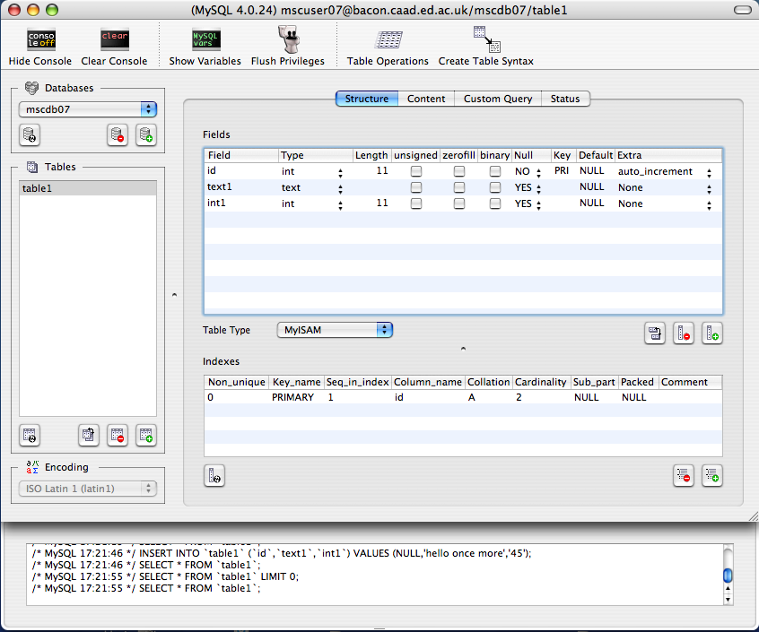

### Connecting to the PHP server

The overall picture of the situation is like this:

We have our own PHP server, which is called *playground* and is
administered by Geoff Lee. You can connect to the PHP server very easily
from a Mac OS machine, by using the Samba protocol. **Note that you will
have to be on the University network or the VPN** -- see the foot of
this page for details. Type Command-K (AppleKey-K) in the Finder, to get
the Connect to Server dialogue. Then enter (or choose from the menu if
it's already there) the following URL:

<smb://playground.eca.ed.ac.uk/playground_people>

-- this should bring up a box in which you need to enter your
University Universal Username (UUN) and password (the same as you use
for accessing SMS mail etc.). You should then, perhaps after some delay,
simply get a normal-looking Finder window called *playground_people*,
with a lot of other folders in it, including one named with your UUN.
You should only be able to read, write, or create new folders and files,
in your own folder. You will find a folder inside your own folder,
called *html* -- anything placed in here will be visible to the web
(but not anything placed outside it). Feel free to create anything you
like in your own folder and experiment with copying and editing PHP
templates in it. Any PHP template that you put here, if its filename
ends in ".php", should be interpreted by the PHP server as described
in these notes.

**Note:** For further instructions on how to connect from Windows
machines, and how you can alternatively connect using SFTP, please see
[the ECA Computing Wiki page
here](https://www.wiki.ed.ac.uk/display/ECAIT/Experimental+web+server).
You will always need to be on the VPN to connect to a database, but you
don't need to use the VPN to work with your files using SFTP.

All information about *playground* given here should be consistent with
details that you can also find on the [ECA computing
wiki:](https://www.wiki.ed.ac.uk/pages/viewpage.action?spaceKey=ECAIT&title=Experimental+web+server)
if there are any discrepancies, the information on the wiki is probably
correct.

Please don't create files anywhere else on this server, even if it
turns out that you can. Please also note that you do not have unlimited
disc space available on this server (and in fact you have a limited
quota allocation), so if you have many or large images etc. in your
pages it's possible that the space will fill up. If this
happens,[contact me](mailto:J.Lee@ed.ac.uk).

The top-level folder you get to through this process is visible on the
web as <http://playground.eca.ed.ac.uk/> . Your *html* folder, and other
folders you create in it, will be visible at a URL created by extending
this one by using your UUN with a tilde character (~) in front of it,
as for example in my case:
[http://playground..ed.ac.uk/~jlee](http://playground.eca.ed.ac.uk/~jlee).
The "html" part does *not* appear in the URL. Please note that these
URLs are currently visible to the world, so be aware of this and
consider issues of copyright and suitability when placing material on
this server.

### Using MySQL

MySQL is a powerful database system traditionally used via a UNIX
command-line, entirely by writing SQL commands. This is hugely flexible,
but not very attractive. Luckily there is a very neat freeware graphical
interface that runs under OS X and generates the SQL commands for you.
MySQL is also server-based, which means that for our purposes we will
always be using databases provided by the MySQL server running on our
own server, *playground*.

To access the databases, use the application ***SequelPro***. (See
<http://www.sequelpro.com/> for details.) When it's launched, type
Command-N (or choose New from the File menu) to create a new connection.
A dialogue box asks for various things -- you need only enter the host,
user, password and database. The host is *playground.eca.ed.ac.uk*. In
your folder on *playground*, you should have a file called
*database_info.txt*: this tells you the username and password to use.
Your database is named with your username, so just enter that again
there.

[If you are using Windows, or some flavour of Linux, etc., then you
will not have *SequelPro*, but you have several similar applications
available. Even on Windows, some of these are free. I don't have
specific recommendations. If you can find nothing else, a default option
on any platform is [MySQL
Workbench](https://dev.mysql.com/downloads/workbench/) from the MySQL
development team, or if you install
[MAMP](https://www.mamp.info/en/)/[LAMP](https://bitnami.com/stack/lamp/installer)/[WAMP](http://ampps.com/wamp)
you will get *PHPMyAdmin*, which is a little clunky but effective.]

There may be a short wait while the connection is made. The title bar of
the window will indicate the connection once you have one. The interface
will look rather like this (click for full-size image) -- though the
database name and server will be different:

[

The console at the bottom can be displayed with the buttons at the top
left. It shows you the SQL commands that are being sent to the server,
and you'll see that some of these are similar to the ones you have to
write in PHP -- you can write other specific queries and test out what
they do by using the "Custom Query" tab. The Databases list at the
upper left shows you the databases that the server can serve. However,
you do not have privileges to access all of these. By convention,
everyone can access the database *test*.

You should have full privileges to create, change and delete tables in
your database. **Be very careful with this!** **If you change or delete
something, there is NO WAY OF UNDOING IT!** (If you are considering a
major change to a table that might be important, ALWAYS make a duplicate
copy of it first, just in case.)

You can create new tables, as you wish. When you've created a table,
you have to add specifications of fields one at a time, in the
"Structure" view as shown above (similar e.g. to the "Design" view
in MS Access). You can then change to the "Content" view and add and
edit the table rows (much as in the "Datasheet" view in Access or
similar things in FileMaker etc.).

You can also define keys and relationships between the tables. Consult
the SequelPro Help information, and a reference text on SQL for further
information. There is also (extremely extensive) [online MySQL
documentation](http://dev.mysql.com/doc/refman/4.1/en/index.html).

We assume that for our purposes here, we will mostly only need to create
tables and specify the types for all the fields. That is, we will only
need to create the Structure (or Design) of the database. Then content
will normally be added and manipulated via PHP. If necessary, however,
it is also possible to import data from files, even e.g. data files
exported from other databases created in Access or Excel etc.

Notice that MySQL data fields can contain all kinds of things, including
image data; but usually we will want to keep images as files on a web
server, and simply include the URL in the database.

### Accessing MySQL from PHP

We will be doing this using the Fat Free Framework. See the lecture
notes for details. ***Do NOT use the simpler and older MySQL extension,
or even MySQLi, as used e.g. by w3schools***. PHP is extremely
vulnerable to attacks and exploits by all kinds of hackers: *be afraid,
be very afraid!* Do not use code of unknown quality acquired from random
sources. There are many sources of good, tested and reliable PHP code:
always use these.

The consequences of people hacking a PHP server can be severe. It can be
crashed, have databases destroyed, used to attack and seriously damage
other servers, or send torrents of junk email. The University will shut
down any server that seems to have been hacked. Luckily, *playground* is
fairly well insulated from other servers and mostly will cause problems
only for you and your fellow students if it is damaged; but that's bad
enough! And if you break it, you will have to contend with the wrath of
Geoff, who will have to reinstate it. We expect that there will be
genuine accidents, and we're prepared for them; but there is no excuse
for just being careless.

### Restrictions on remote connections

Although connecting from machines in the studio should be fine, you'll
find that you cannot connect via Samba to the playground server, nor to
the MySQL server, from machines outside the University domain (e.g. if
you are using a third-party ISP from home). This is because we have
firewalls for security purposes. However, you can use the University's
Virtual Private Network (VPN) --- once you are connected to the VPN,
your machine appears to be within the University domain, and everything
is OK. See
<http://www.ed.ac.uk/schools-departments/information-services/computing/desktop-personal/vpn>
for details of how to do this. The same applies if you are connecting
via wireless, in the usual way (so if you are used to connecting using
wireless via the VPN, this should all work the same as usual).

 

 
