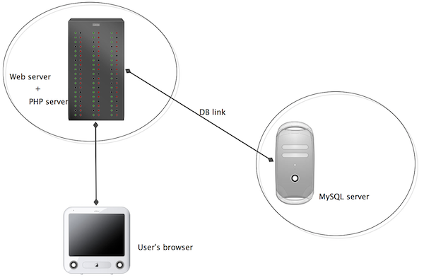

## Edinburgh Domains

For this course, it's necessary to have access to a web server on which
you can build your own web site using arbitrary tools. For this purpose,
we are using "Edinburgh Domains", a service licensed to the University
that provides each user with their own individual web server, and an
associated domain name.

This is made available through the University's EASE login system: to
register for it you should go to
[https://edinburgh.domains](https://edinburgh.domains/) and click on the
(not very obvious) link that says "SAML Login", then on the next page
"Get Started".

On this server, you are very much in control -- you can install
software, change configurations, and many other things. It provides for
using the PHP language to process server scripts, and it provides a
MySQL database system, which we'll be using for the projects in this
course.

This is actually a custom version of a commercial service called
"Domain of One's Own" (DoOO) -- you'll find that some of the
instructional material (videos) on this course were made with the
commercial service, but the differences are minimal. Most web service
providers, in fact, use tools and systems that are very similar to
these, so skills that you learn with this arrangement will be highly
transferable to other situations.

Once you're into the Edinburgh Domains system, make sure that you're
looking at the "Dashboard". Here, you'll find links to an impressive
array of tools that you can use to do all kinds of things. Specifically,
we'll need to set up a database and make sure that we can connect to
the server using a protocoal called SFTP. This is almost all that we'll
need to do here -- most work with the server subsequently will be done
by simply using the database through PHP.

The generic picture of the situation is like this:

The "Edinburgh Domains server" is actually a _host_ that hosts the
MySQL server as well as the web and PHP servers, so when you make a
connection from PHP code you can connect to MySQL by specifying
"localhost", which means the same host as the PHP server. However, if
you want to connect to it from code (or a client) on a different host,
such as your own machine, you will need to provide the appropriate host
name for your Edinburgh Domains MySQL server.

To access the Edinburgh Domains server, one option is work throught its
own online Dashboard, which provides a file manager to manage the files
you store on it, as well as management tools for the database server,
etc. However, this is quite inconvenient and often we will want a more
direct form of connection, which is done through a method called SFTP
(secure file transfer protocol). There are many SFTP clients available,
such as Cyberduck. You can use any of these. But also, you can make SFTP
connections directly within PHPStorm, which allows you to manage the
connection and your project code in a very integrated way.

Before you can access your Edinburgh Domain through SFTP, you have to
configure it. In the Dashboard, you'll see at the very top of the
screen, not actually on the dashboard but above the Edinburgh logo, a
link that says "Manage your Account". On the drop-down menu under
this, choose "User Information". Then you have the option to create an
FTP password. It also tells you your username, hostname and port --
these are the crucial details, along with the password, that any SFTP
client (or PHPStorm) will need. Create a password, and keep a note of it
(though you can create a new one without it, if it gets lost). Then
follow instructions for connecting with your chosen SFTP client, or (as
in the introductory video) from inside PHPStorm.

Once you have connected, you should find that you can see the folders
and files in your _home folder_ (or _home directory_ in the more
traditional language I may use from time to time). **_Do not delete
anything in here without understanding what it is and why you don't
need it! _** Many of these files may be quite important. Similarly,
it's best not to put files into most of the folders that you can see.
You should see a folder called _public_html_ -- this is the folder
that provides the _web root_ of your web site: anything in this folder
is visible on the web, with a URL that starts with
"<your_domain>.edinburgh.domains". Nothing outside this folder is
visible on the web at all. (For this reason, we'll later create a
folder called _AboveWebRoot_ that is outside this folder and hence not
visible on the web.) Note that "public_html" does _not_ appear in any
URL.

Please note that URLs to your server are _visible to the world_, so be
aware of this and consider issues of copyright and suitability when
placing material on this server. When using this hosting service, you
are still bound by the University of Edinburgh Computing Regulations, as
well as normal laws and conventions.

It will be useful to set your client (or PHPStorm, or the Edinburgh
Domains file manager) so that it shows "hidden files". These are files
that start with "." and which you normally can't see. You may see
quite a few of them, which can mostly be ignored, but later (to use the
Faat Free Framework) we'll need to use one called "_.htaccess_".

### Using MySQL

MySQL is a powerful database system traditionally used via a UNIX
command-line, entirely by writing SQL commands. This is hugely flexible,
but not very attractive. Luckily there are many neat, often freeware,
clients with graphical interfaces that will generate the SQL commands
for you. MySQL is also server-based, which means that for our purposes
we will always be using databases provided by the MySQL server running
on your own Edinburgh Domain host. The Dashboard provides for
administration of the database using _PHPMyAdmin_, which is a client
written in PHP; it's a little little clunky, but effective. With this,
you can create tables, edit the contents, etc. But first, you need to
create a database. You do this using the "MySQL Database Wizard" on
the Dashboard. It's pretty self-explanatory. Create a database, and a
user, and give the user "All Privileges" when prompted. Note what you
have called the database and the user, and the password you will have
had to create for the user: you'll need these to connect to the
database from PHP or a client. When you go into PHPMyAdmin on your host,
you'll see that it shows the database you've created (you could create
more than one, but for our purposes one is enough), and then you can
select it and create tables. For the Simple Example you should create a
table called _simpleModel_. See notes, videos etc.

You will have full privileges to create, change and delete tables in
your database. **Be careful with this!** **If you change or delete
something, there is NO WAY OF UNDOING IT!** (If you are considering a
major change to a table that might be important, ALWAYS make a duplicate
copy of it first, just in case.)

You can create new tables, as you wish. When you've created a table,
you have to add specifications of fields (columns) one at a time, in the
"Structure" view. You can then change to the "Browse" view and add
and view the table rows.

You can also define keys and relationships between the tables. Consult
any text on SQL for further information. There is also (extremely
extensive) [online MySQL
documentation](http://dev.mysql.com/doc/refman/4.1/en/index.html).

We assume that for our purposes here, we will mostly only need to create
tables and specify the types for all the fields. That is, we will only
need to create the Structure of the database. Then content will normally
be added and manipulated via PHP. If necessary, however, it is also
possible to import data from files, even e.g. data files exported from
other databases created in Access or Excel etc.

Notice that MySQL data fields can contain all kinds of things, including
image data; but usually we will want to keep images as files on a web
server, and simply include the URL in the database.

### Accessing MySQL from PHP

We will be doing this using the Fat Free Framework. See the lecture
notes for details. **_Do NOT use the simpler and older MySQL extension,
or even MySQLi, as used e.g. by w3schools_**. PHP is extremely
vulnerable to attacks and exploits by all kinds of hackers: _be afraid,
be very afraid!_ Do not use code of unknown quality acquired from random
sources. There are many sources of good, tested and reliable PHP code:
always use these.

### Consequences of hacking

The consequences of people hacking a PHP server can be severe. It can be
crashed, have databases destroyed, be used to attack and seriously
damage other servers, or to send torrents of junk email. Your Edinburgh
Domains server is fairly insulated from anything else and will cause
problems mostly just for you and your fellow students if it is damaged;
but that's bad enough! If things go really seriously wrong, it may have
to be shut down by the providers. In this situation, most likely,
everything on the server will be lost and you will simply have an empty
one: therefore, _always make sure that you have a copy of your work
somewhere else_. If you follow the recommended process of mirroring your
site from a local machine using PHPStorm, then most of your recovery is
a simple matter of uploading the site again, _but note that you will
have lost any database data_, so if any of this is important it should
also be copied elsewhere. We expect that there will be genuine
accidents, and we're prepared for them; but there is no excuse for just
being careless.
