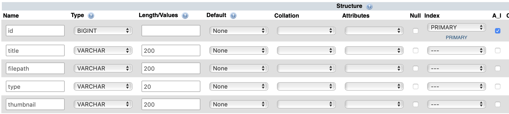

This is a very basic example of how to implement an image server the Fat Free Framework.

## Structure

The structure is identical to the `FFF-SimpleExample`. If you have not got that example working yet, then do that first.

### `autoload/ImageServer.php`

The main addition to the `FFF-SimpleExample` is the `ImageServer` class in `autoload/ImageServer.php`.

## Setup

There are a couple of steps to take in order to setup this example

1. go to your edinburgh.domains dashboard
2. go to **phpMyAdmin**
3. Select your database `Username_DatabaseName`
4. click `New`

5. add a new table named `picdata_fff` with these columns
    - You will need to add an additional column

| Name      | Type    | Length | Index   | A_I |
| --------- | ------- | ------ | ------- | --- |
| id        | BIGINT  | -      | Primary | x   |
| title     | VARCHAR | 200    | -       | -   |
| filepath  | VARCHAR | 200    | -       | -   |
| type      | VARCHAR | 20     | -       | -   |
| thumbnail | VARCHAR | 200    | -       | -   |

- you can leave other unmentioned attributes blank.
- when you check `A_I` or `Primary` just click `Go` on the pop-up

6. click `Save`

## What Actually Happens?

### Upload

1. The image is uploaded
    1. `Web::instance()->receive` deals with getting things on the server
    2. `ImageServer::receiveCallback` can be configured for dealing with when things go wrong
2. the `store` function actually saves the metadata to the database.
    1. images don't get stored in a database as they are too large.
    2. you can configure `store` to match your own requirements

### View Image

The chain of events for viewing an image in via `FFF-ImageServer/viewimages/` url is:

1. viewimages calls ImageServer and gets all data
2. this is passed to the `datalist` variable of `viewimages.html`
3. `viewimages.html` then calls  `FFF-ImageServer/image/@id` and `FFF-ImageServer/thumb/@id` urls
4. `FFF-ImageServer/thumb/@id` forwards raw data to `` as files are above web root.
5.  Both `FFF-ImageServer/thumb/@id` `FFF-ImageServer/image/@id` can be used in conjunction with ``.
