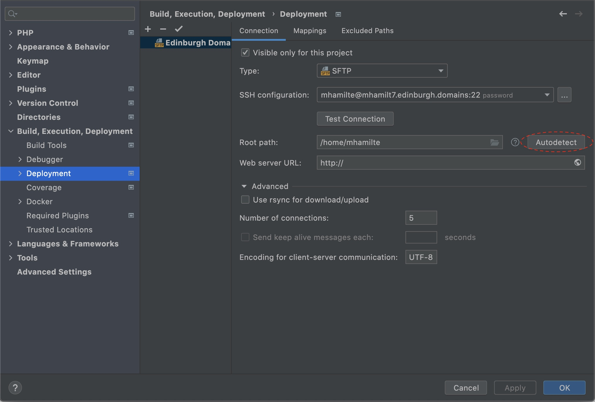
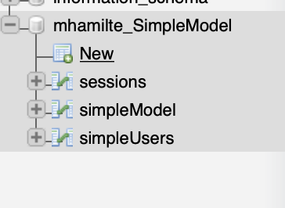
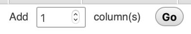

Now you have your SFTP connection setup we can upload the FFF-SimpleExample.

There are a few setup steps that need to be run through first. Be sure to read each step carefully. It may be worthwhile reading all steps first before following along. Get in touch with the tutors if you have any problems.

## Table of Contents

- [Setup](#setup)
  - [1. Add Fat Free Framework (FFF)](#1-add-fat-free-framework-fff)
  - [2 . Add FFF-SimpleExample](#2-add-fff-simpleexample)
  - [3. Mapping folders](#3-mapping-folders)
  - [4. DatabaseConnection Setup](#4-databaseconnection-setup)
    - [4a. Create Database](#4a-create-database)
    - [4b. Create a table](#4b-create-a-table)
    - [4c. Set Authentication](#4c-set-authentication)
  - [5. Upload to Server](#5-upload-to-server)
- [About the Example](#about-the-example)
  - [**autoload/** [Role: Model / Controller]](#autoload-role-model-controller)
  - [**index.php** [Role: Controller]](#indexphp-role-controller)
  - [**ui/** [Role: View / Controller]](#ui-role-view-controller)

## Setup

### 1. Add Fat Free Framework (FFF)

1.  Go to the [FFF Website](https://fatfreeframework.com/3.6/home)
2.  [Download the latest release](https://github.com/bcosca/fatfree/archive/master.zip)
3.  In PHPStorm Create a Directory named `AboveWebRoot`
4.  Add copy the contents of `fatfree-master` folder to the `AboveWebRoot` Directory


5.  Go to `Build, Execution, Deployment` -> `Deployment`,
6.  go to `Mappings` tab
7.  Click <kbd>Add New Mapping</kbd>

    -   Local Path: `AboveWebRoot` folder you just creates
    -   Deployment Path:
        -   right click the top level
        -   create a Directory named `AboveWebRoot` 
    -   Web Path: `/`
    -   click Okay

8.  Right click the `AboveWebRoot` directory in your PHPStorm project and select `Deployment` -> `Upload to YOUR_DOMAIN.edinburgh.domains`
9.  Fat free should now be on your server. Check in your `edinburgh.domains` File Manager to make sure.

### 2 . Add FFF-SimpleExample

-   First [download the `FFF-SimpleExample.zip`](<>)
-   moved the unzipped folder to your PHPStorm project folder.
-   In `AboveWebRoot` create an `autoload` folder
-   move the `DatabaseConnection.php` in your `FFF-SimpleExample/autoload` to `AboveWebRoot/autoload`

### 3. Mapping folders

-   Go to `Build, Execution, Deployment` -> `Deployment`,
-   Click Autodetect next to Root Path. This should set Root Path to: `/home/DOMAIN_USERNAME`
    -   You could now also set Web Server url: `https://YOUR_DOMAIN.edinburgh.domains`.



-   go to the `Mappings` tab and set
    -   Local Path: click folder icon and select your project folder
    -   Deployment Path: click folder icon and select `/public_html/FFF-SimpleExample`
    -   you may need to create the `FFF-SimpleExample` folder
    -   Web Path: `/FFF-SimpleExample`


* * *

To use the FFF-SimpleExample as a template:

-   add the `FFF-SimpleExample` Folder to your PHPStorm project.
-   change the `FFF-SimpleExample` Folder name to you project name
-   move the contents of `autoload` to `AboveWebRoot/autoload`
-   [update the mappings](./phpstorm-sftp-setup.html#map-a-folder)


### 4. DatabaseConnection Setup

#### 4a. Create Database

1.  go to your edinburgh.domains dashboard
2.  go to **MySQL® Databases**
3.  Create a Database
    1.  name the database `SimpleModel`
    2.  click `Create Database`
4.  Add New User:
    4.  just use the same username you have already e.g. `username_username`
    5.  type a password
    6.  click `Create User`
5.  Add User to Database
    8.  Your username should be the only one in the drop down.
    9.  add this to the `username_SimpleModel` database
    10. click `Add`

#### 4b. Create a table

1.  go to your edinburgh.domains dashboard
2.  go to **phpMyAdmin**
3.  Select your database `Username_DatabaseName`
4.  click `New`
    
5.  add a new table named `simpleModel` with these columns
6.  You will need to add an additional column
    

| Name   | Type    | Length/Values | Index   | A_I |
| ------ | ------- | ------------- | ------- | --- |
| id     | BIGINT  | -             | Primary | x   |
| name   | VARCHAR | 200           | -       | -   |
| colour | VARCHAR | 200           | -       | -   |

-   you can leave other unmentioned attributes blank.
-   when you check `A_I` or `Primary` just click `Go` on the pop-up


6.  click `Save`

#### 4c. Set Authentication

1.  Go to `AboveWebRoot` `>` `autoload` `>` `DatabaseConnection.php`
2.  Fill in the missing details of the file

```php
class DatabaseConnection {

  static function connect() {
      return new DB\SQL(
      'mysql:host=localhost;port=3306;dbname=<USERNAME_DATABASENAME>',
      '<USERNAME_USERNAME>',
      'PASSWORD'
      );
  }

}
```

### 5. Upload to Server

To upload all files in your project:

-   Right click the project folder
-   `Deployment` -> `Upload to YOUR_DOMAIN.edinburgh.domains`


Your site should now be available at `YOUR_DOMAIN.edinburgh.domains/FFF-SimpleExample`.

***

## About the Example

Noted below are the parts of this project and which role within the MVC design pattern it concerns.

### **autoload/** [Role: Model / Controller]

`autoload` contains the `SimpleController` class that will usually be relevant for interacting with your MySQL Database.

Both the Model _and_ the Controller will need to decide on how the `SimpleController` works.

### **index.php** [Role: Controller]

`index.php` is where the routing on your site happens. Every request for a webpage on your site ends up here.
This is where the _Controller_ will take data form the _Model_ and send it to the _View_. It is also where data is collected
from the _View_ and sent to the _Model_.

### **ui/** [Role: View / Controller]

The `.html` files within the `ui/` folder are where your _View_ decides on how pages are organised. Both _View_ and
_Controller_ will need to talk to each other to decide on how the site is templated and naming conventions for variables.
Every time you see `{{ "{{" }} @A_Variable }}`, the _View_ and the _Controller_ probably need to talk to each other.
