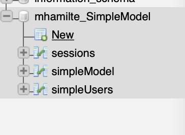
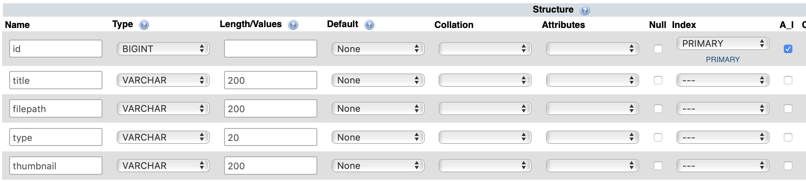

## Create Database

1.  go to your edinburgh.domains dashboard
2.  go to **MySQL® Databases**
3.  Create a Database
    1.  name the database `SimpleModel`
    2.  click `Create Database`
4.  Add New User:
    4.  just use the same username you have already e.g. `username_username`
    5.  type a password
    6.  click `Create User`
5.  Add User to Database
    8.  Your username should be the only one in the drop down.
    9.  add this to the `username_SimpleModel` database
    10. click `Add`

## Create a table

1.  go to your edinburgh.domains dashboard
2.  go to **phpMyAdmin**
3.  Select your database `Username_DatabaseName`
4.  click `New`
    
5.  add a new table named `simpleModel` with these columns
6.  You will need to add an additional column
    

| Name   | Type    | Length/Values | Index   | A_I |
| ------ | ------- | ------------- | ------- | --- |
| id     | BIGINT  | -             | Primary | x   |
| name   | VARCHAR | 200           | -       | -   |
| colour | VARCHAR | 200           | -       | -   |

-   you can leave other unmentioned attributes blank.
-   when you check `A_I` or `Primary` just click `Go` on the pop-up
    

6.  click `Save`

## Configure Fat Free

1.  Go to `AboveWebRoot` `>` `autoload` `>` `DatabaseConnection.php`
2.  Fill in the missing details of the file

```php
class DatabaseConnection {

  static function connect() {
      return new DB\SQL(
      'mysql:host=localhost;port=3306;dbname=USERNAME_DATABASENAME',
      'USERNAME_USERNAME',
      'PASSWORD'
      );
  }

}
```
