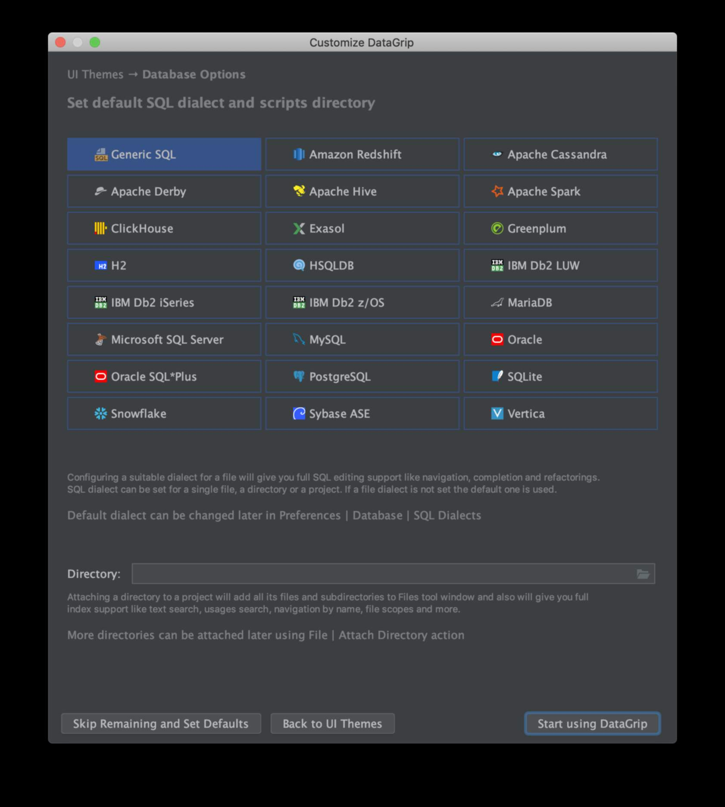
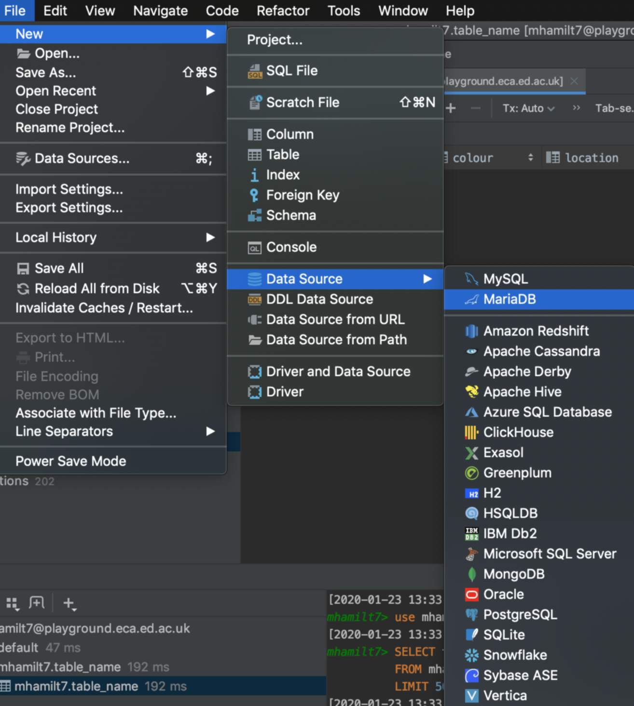
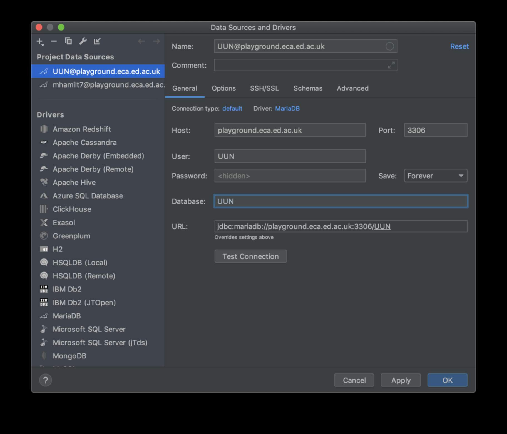
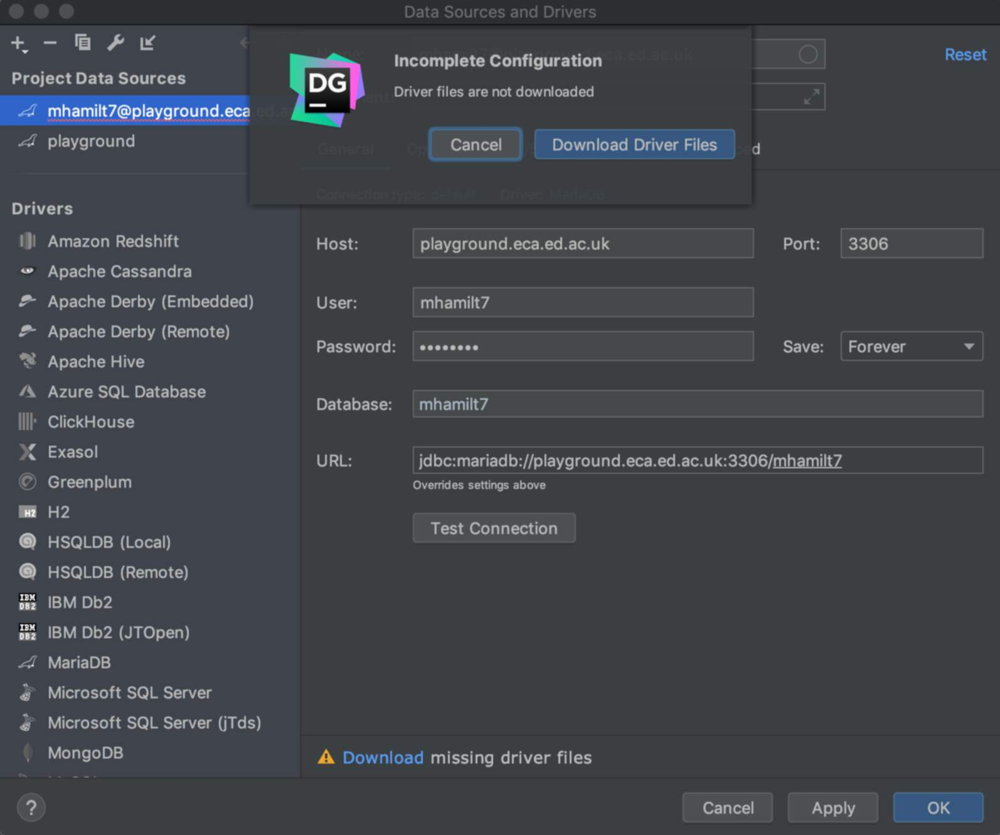
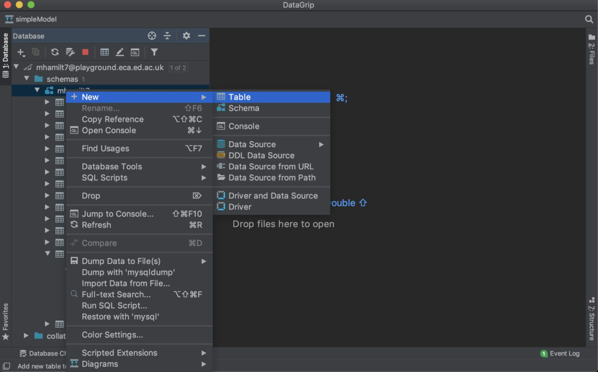
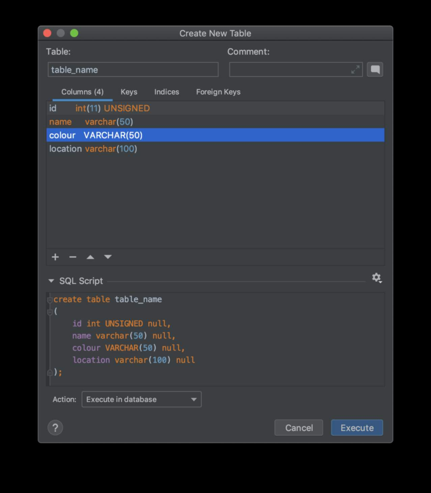
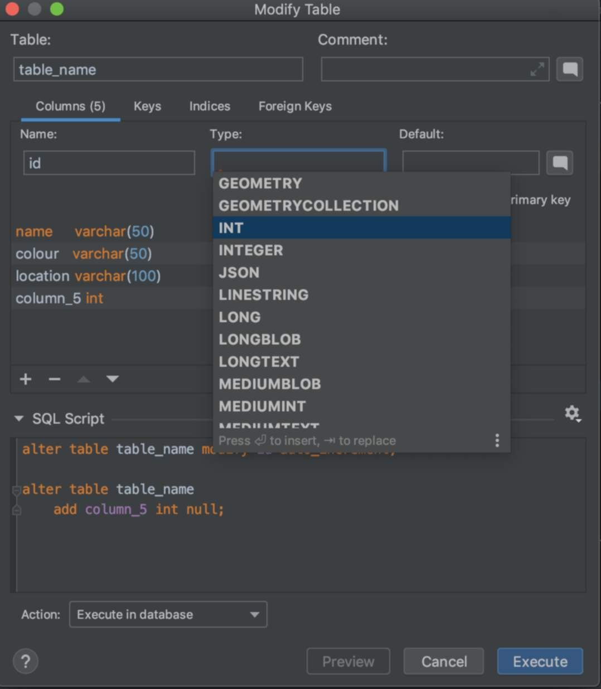
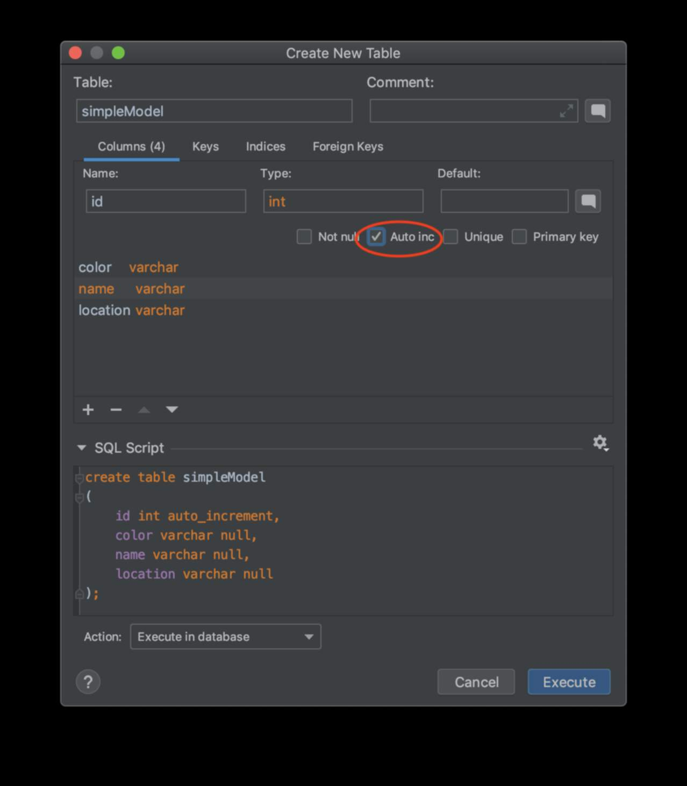
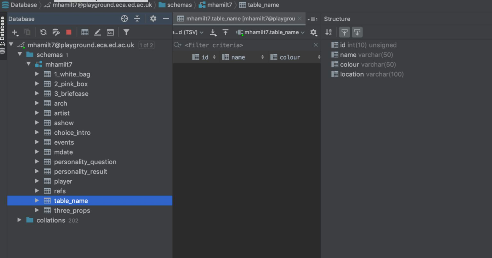
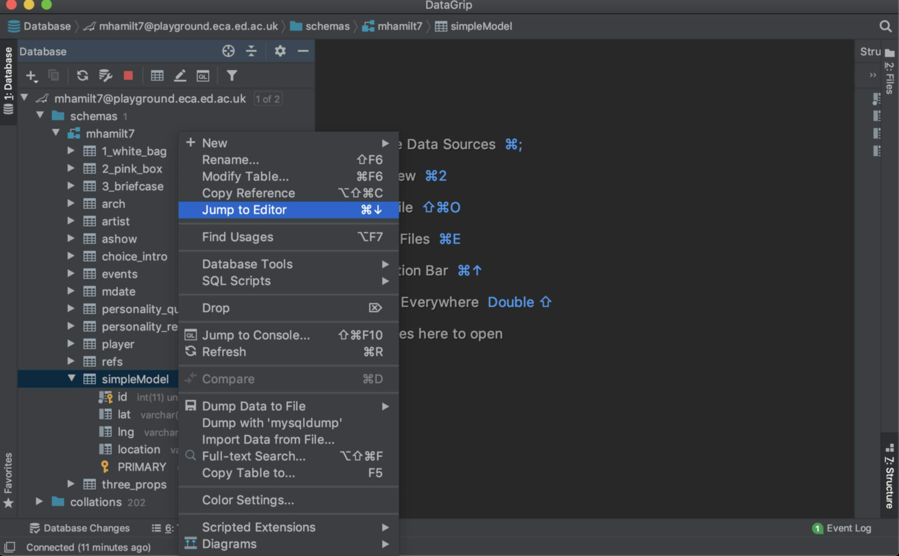

This article will show you how to access your database in order to explore the structure and make some basic modifications. You will eventually not need DataGrip as you will be able to create and edit tables of your database directly though php with FFF.

## Install

If you have installed PHPStorm, follow the same process but select DataGrip. [Sign-in to JetBrains to see your academic licence](https://account.jetbrains.com/login)

### First Start

When you first start DataGrip you will be asked to set some defaults. **Just skip this stage**

## Accessing your database

### Connecting to the Database

To connect to your Database, select `File` > `Data Source` > `MariaDB`

Fill in the details

| Name     | Give it a Name                             |
| -------- | ------------------------------------------ |
| Host     | playground.eca.ed.ac.uk                    |
| Port     | 3306                                       |
| User     | Your Student Number                        |
| password | Database Password from `database_info.txt` |
| Database | Your Student Number                        |

**Your Student Number e.g.:** s12345678

Click test connection and, if prompted, install drivers.

### Creating a table

Create a table by right clicking on your database and select `New` > `Table`

Add in your columns with the `+` icon. Give your column a name and type.

You can find a suggestion for type by pressing AutoComplete <kbd>CTRL</kbd> + <kbd>SPACEBAR</kbd>

The most common types you will use are `int` and `varchar`. The number in brackets is the size of the field.

**e.g:** `varchar(50)` can stor a maximum of `50` characters.

**NB:** don't forget to check the `Auto inc` checkbox if you need a number to automatically increase.

### [Structure View](https://www.jetbrains.com/help/datagrip/structure-tool-window-file-structure-popup.html)

To view and edit the structure of your table, navigate through the top bar menu `View | Tool Windows | Structure`.

### [Data View](https://www.jetbrains.com/help/datagrip/settings-tools-database-data-views.html)

To view a table, double click on the side bar **OR** right click on the table and select `Jump To Editor`

## Shortcuts / HotKeys

As with any editor, it is a wise idea to [manage your keyboard shortcuts](https://www.jetbrains.com/help/datagrip/configuring-keyboard-and-mouse-shortcuts.html) to make you more efficient at working. System wide keyboard shortcuts will override any for the app.

**z.B:** If you use translation software, you will likely need to reconfigure your Autocomplete keys.

Work smart, not hard.

## Resources

- [The DataGrip Manual](https://www.jetbrains.com/help/datagrip/)
