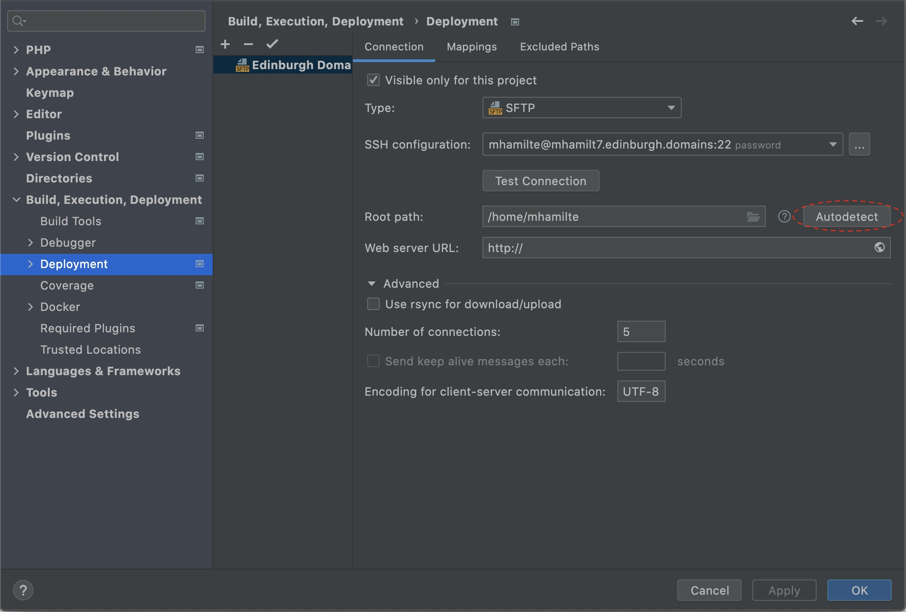
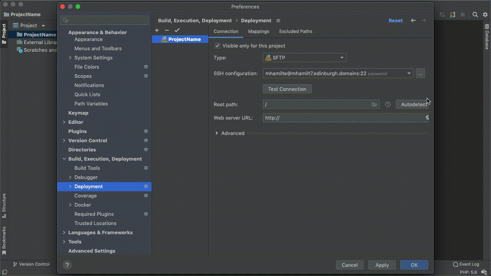
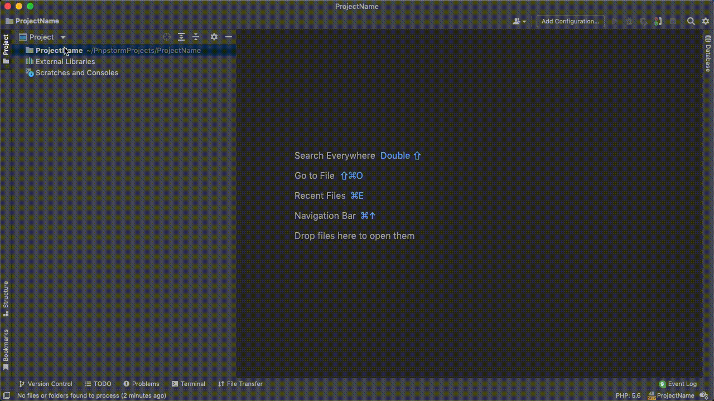
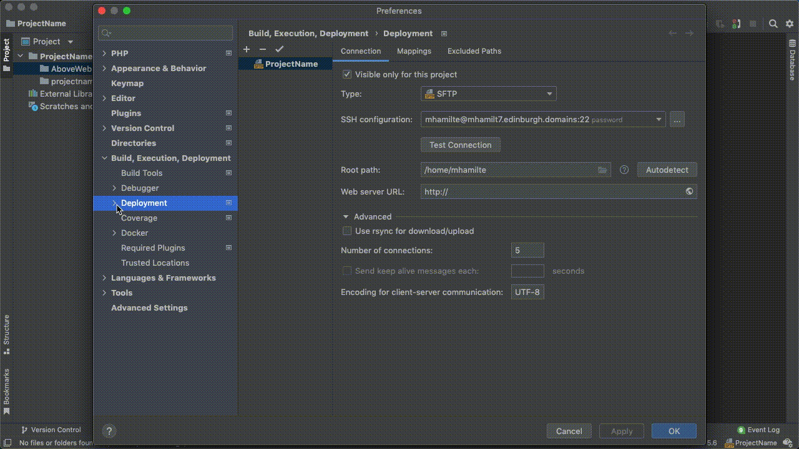
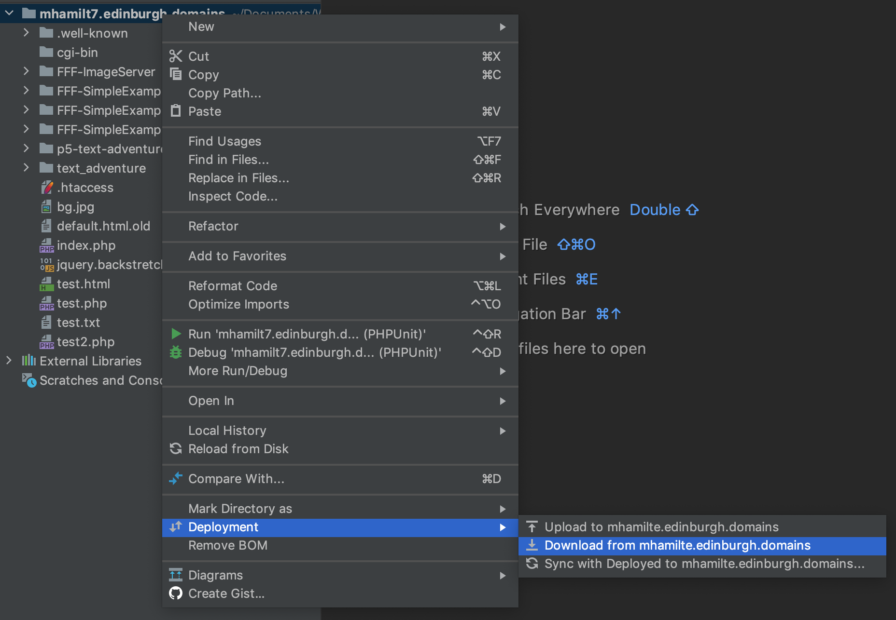

It is recommended that you use the [FFF-SimpleExample](./FFF-SimpleExample.html) as the template for your project. This document will walk you through on how to do that.

## Setup

Make sure you have first run through

- [PHPStorm Setup](./phpstorm-sftp-setup.html)
- [Fat Free Framework Setup](./fat-free-framework-setup.html)
- [Database Setup](./database-setup.html)

## Mapping

-   Go to `Build, Execution, Deployment` -> `Deployment`,
-   Click Autodetect next to Root Path. This should set Root Path to: `/home/DOMAIN_USERNAME`
    -   You could now also set Web Server url: `https://YOUR_DOMAIN.edinburgh.domains`.

-   go to the `Mappings` tab and set
    -   Local Path: click folder icon and select your project folder
    -   Deployment Path: click folder icon and select `/public_html/projectname`
      -   you may need to create the `projectname` folder
    -   Web Path: `/`

- (Optional) Depending on your role, it might be more relevant to map a separate `AboveWebRoot` and `projectname` folder instead.

### Deployment Options

Once you have succesfully setup and mapped your project, there are a couple more options to configure in `Build, Execution, Deployment` -> `Deployment` -> `Options`:

-   Set `Upload changed files automatically to the default server` select `on explicit action`
-   Click `Override default permisions on files` and make sure it is set to `(644)`
-   Click `Override default permisions on folders` and make sure it is set to `(755)`

* * *

### Download from Server

-   Right Click your project folder
-   Navigate to `Deployment` -> `Download from your_domain.edinburgh.domains`

### Upload to server

To upload all files in your project:

-   Right click the project folder
-   `Deployment` -> `Upload to YOUR_DOMAIN.edinburgh.domains`

