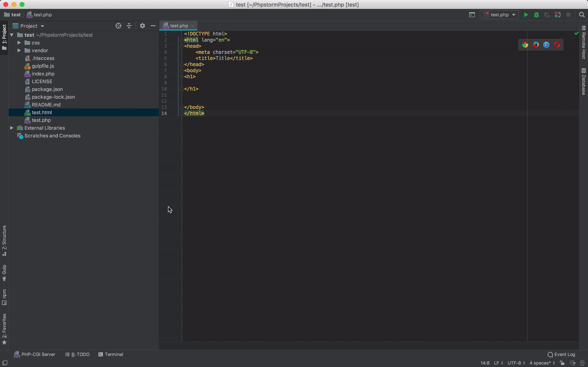

Sometimes it's nice to test out ideas on your own or just as a means of [Staging](https://en.wikipedia.org/wiki/Deployment_environment#Staging) before uploading to your web server. Here are a few ways you can run php locally to do some debugging.

* * *

## PHP REPL

If you are running macOS then you can run a local PHP REPL (Read, Evaluate, Print, Loop) in the Terminal with this command. If you are on windows or linux, you will need to install PHP (see below)
```sh
    php -a
```
You can now type in individual lines of PHP code to see if they work, a great tool for debugging. Try

```php
echo 'Hello, World!';
echo 1 + 1;
```

You can also run php scripts with:

```php
require_once('PATH/TO/FILENAME.php')
```

* * *

## Installing PHP

<div>
  <ul class="nav nav-tabs nav-justified" role="tablist">
    <li role="presentation" class="active"><a data-os="windows" href="#shell-windows" aria-controls="Windows" role="tab" data-toggle="tab"><i class="fa fa-windows"></i> Windows</a></li>
    <li role="presentation"><a data-os="macos" href="#shell-macos" aria-controls="MacOS" role="tab" data-toggle="tab"><i class="fa fa-apple"></i> macOS</a></li>
    <li role="presentation"><a data-os="linux" href="#shell-linux" aria-controls="Linux" role="tab" data-toggle="tab"><i class="fa fa-linux"></i> Linux</a></li>
  </ul>
  <div class="tab-content">
    <article role="tabpanel" class="tab-pane active" id="shell-windows">
      <ol>
        <li>
           <a href="https://www.apachefriends.org/index.html" rel="nofollow">Open the XAMPP website.</a>
        </li>
        <li>
          Click XAMPP for Windows.
        </li>
        <li>
          Double-click the downloaded file.
        </li>
        <li>
          Click Yes when prompted. This will open the XAMPP setup window.
        </li>
        <li>
          Click Next. until install location option.
        </li>
        <li>
          Select an installation location. Click the folder-shaped icon to the right of the current installation destination, then click a folder on your computer.
          <ul>
            <li>If you have the
              <a href="https://docs.microsoft.com/en-us/windows/security/identity-protection/user-account-control/how-user-account-control-works">
                UAC
              </a>
              activated on your computer, avoid installing XAMPP in your hard drive's folder (e.g., OS (C:)).
            </li>
            <li>
              You can select a folder (e.g., Desktop) and then click Make New Folder to create a new folder and select it as the installation destination.
            </li>
          </ul>
        </li>
        <li>
          Click OK.
        </li>
        <li>
          Click Next.
        </li>
        <li>
          Uncheck the "Learn more about Bitnami" box, then click Next.
        </li>
        <li>
          Begin installing XAMPP. Click Next
        </li>
        <li>
          Click Finish when prompted.
        </li>
        <li>
          Select a language.
        </li>
        <li>
          Click Save. Doing so opens the main Control Panel page.
        </li>
        <li>
          Start XAMPP from its installation point. If you need to open the XAMPP Control Panel in the future, you can do so by opening the folder in which you installed XAMPP, right-clicking the orange-and-white
          xampp-control icon, clicking Run as administrator, and clicking Yes when prompted.
          <ul>
            <li>When you do this, you'll see red X marks to the left of each server type (e.g., "Apache"). Clicking one of these will prompt you to click Yes if you want to install the server type's software on your
              computer.</li>
            <li>Counterintuitively, double-clicking the xampp_start icon doesn't start XAMPP.</li>
          </ul>
        </li>
        <li>
          Resolve issues with Apache refusing to run. On some Windows 10 computers, Apache won't run due to a "blocked port". This can happen for a couple of reasons, but there's a relatively
          <a href="https://pureinfotech.com/install-xampp-windows-10/">easy fix</a>
          <ul>
            <li>Click Config to the right of the "Apache" heading.</li>
            <li>Click Apache (httpd.conf) in the menu.</li>
            <li>Scroll down to the "Listen 80" section (you can press <kbd>Ctrl</kbd>+<kbd>F</kbd> and type in <kbd>listen 80</kbd> to find it faster).</li>
            <li>Replace <kbd>80</kbd> with any open port (e.g., <kbd>81</kbd> or <kbd>9080</kbd>).</li>
            <li>Press <kbd>Ctrl</kbd>+<kbd>S</kbd> to save the changes, then exit the text editor.</li>
            <li>Restart XAMPP by clicking Quit and then re-opening it in administrator mode from its folder.</li>
          </ul>
        </li>
      </ol>
    </article>
    <article role="tabpanel" class="tab-pane active" id="shell-macos">
      <p>
        macOS comes with a built-in version of PHP. However, in order to use it with PHPStorm you will need a different version. The easiest way will be to install MAMP
      </p>
      <p>
        To install MAMP:
      </p>
      <ol>
        <li>Open Terminal</li>
        <li>
          First install homebrew by pasting in:

/usr/bin/ruby -e "$(curl -fsSL https://raw.githubusercontent.com/Homebrew/install/master/install)"
        </li>
        <li>
          Then paste:

          brew cask install mamp
        </li>
        <li>
          MAMP should now be in your <code>Applications</code> folder.
        </li>
      </ol>
    </article>
    <article role="tabpanel" class="tab-pane active" id="shell-linux">
      <p>
        In Terminal, paste-in


wget <https://www.apachefriends.org/xampp-files/7.2.2/xampp-linux-x64-7.2.2-0-installer.run>
chmod +x xampp-linux-x64-5.6.33-0-installer.run
./xampp-linux-x64-7.2.2-0-installer.run


      </p>
    </article>

  </div>

</div>

* * *

## PHPStorm

Now you have PHP installed on your machine, you can run your php scripts and webpages in PHPStorm. Here is a step by step and see the GIF below.

1.  Go to: `Preference` `>` `Languages & Frameworks` `>` `PHP`
2.  Click `...`
3.  Click **+**
4.  In `PHP Executable` double click the folder icon.
5.  Navigate to your `XAMPP` or `MAMP`
6.  Select `bin` `>` `php`
7.  Select a php version
8.  In the `bin` directory select `php-cgi`



You can now open your PHP page in a web browser as demonstrated below.


