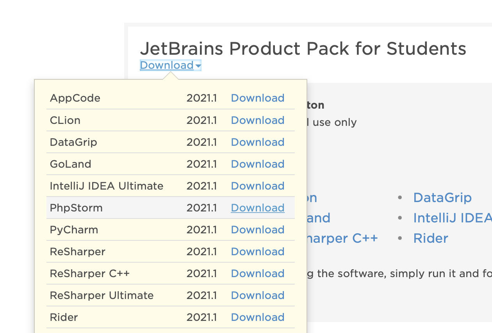
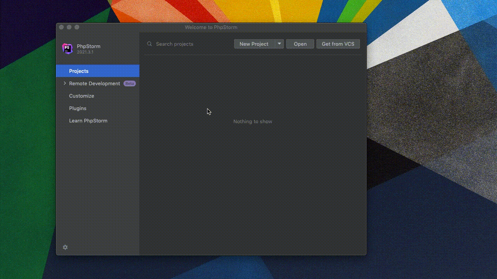
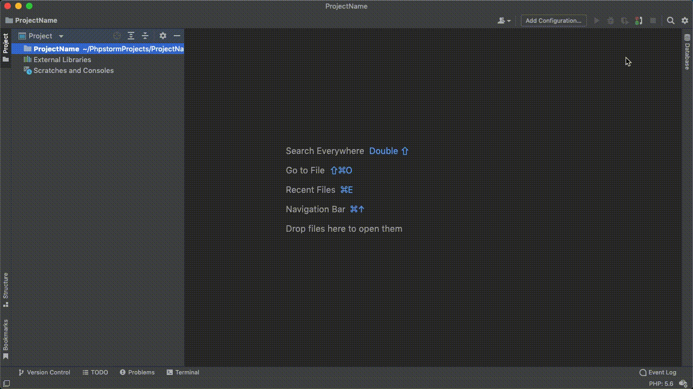
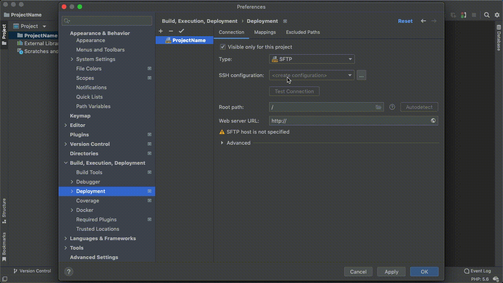

An easy way to edit your site directly is to connect via SSH File Transfer Protocol (SFTP). This guide covers how to upload files over SFTP with PHPStorm. You can approach this 2 ways.

<!--
-   **Method 1:** create a single _main_ project that will allow you to see your entire server
-   **Method 2:** create individual project per site your are working on. -->

If you haven't already, got to [Jetbrains.com/student](https://www.jetbrains.com/community/education/#students) to sign up for your academic licence.

Once you have signed-up, [login to JetBrains](https://account.jetbrains.com/login) and you should see your academic. Click Download under neath the licence to see the apps available and select PHPStorm

* * *

### Create A New Project

* * *

### Set SFTP Server

-   Go to Preferences (or Settings)

    -   <i class="fa fa-apple" aria-hidden="true"></i>: <kbd>⌘</kbd> + <kbd>,</kbd>
    -   <i class="fa fa-windows" aria-hidden="true"></i>: <kbd>Ctrl</kbd> + <kbd>Alt</kbd> + <kbd>S</kbd>

-   `Build, Execution, Deployment` -> `Deployment`
-   Click the <kbd>+</kbd> icon to add a server.
    -   Select SFTP
    -   good idea to name it the same as your domain `your_domain.edinburgh.domains`

-   Next to SSH Configuration, click <kbd>...</kbd>
    -   click <kbd>+</kbd>
    -   Enter these details

| Field                | SFTP                            |
| -------------------- | ------------------------------- |
| Host                 | `your_domain.edinburgh.domains` |
| port                 | `22`                            |
| User Name            | **DOMAIN_USERNAME**†            |
| Authentication type: | Password                        |
| Root Path            | **DOMAIN_PASSWORD**†            |

* * *

**†** Your Domain Username and Password should have been provided in your sign-up email. You can change your password at [edinburgh.domains/user-information/](https://edinburgh.domains/user-information/) (sign-in required)

### Test Connection

-   Click Test Connection
    -   This should be successful. See Troubleshooting if there is an error.
-   Click autodetect next to Root Path. This should be `/home/DOMAIN_USERNAME`
-   Web Server url: `https://YOUR_DOMAIN.edinburgh.domains`. Click the globe icon to test this resolves correctly

* * *

### Map a Folder

-   Go to `Build, Execution, Deployment` -> `Deployment`,
-   go to `Mappings` tab and set
    -   Local Path: click folder icon and select your project folder
    -   Deployment Path: click folder icon and select `/public_html/projectname`
      -   you may need to create the `projectname` folder
    -   Web Path: `/`

- (Optional) Depending on your role, it might be more relevant to map a separate `AboveWebRoot` and `projectname` folder instead.

### Deployment Options

Once you have succesfully setup and mapped your project, there are a couple more options to configure in `Build, Execution, Deployment` -> `Deployment` -> `Options`:

-   Set `Upload changed files automatically to the default server` select `on explicit action`
-   Click `Override default permisions on files` and make sure it is set to `(644)`
-   Click `Override default permisions on folders` and make sure it is set to `(755)`

* * *

### Download from Server

-   Right Click your project folder
-   Navigate to `Deployment` -> `Download from your_domain.edinburgh.domains`

### Upload to server

-   Copy the contents of the [example project]({{site.url}}/example-projects-downloads) into your PHPStorm project's `public_html` folder.

#### Manual Upload

To upload files manually:

-   Right click the project folder
-   `Deployment` -> `Upload to YOUR_DOMAIN.edinburgh.domains`

