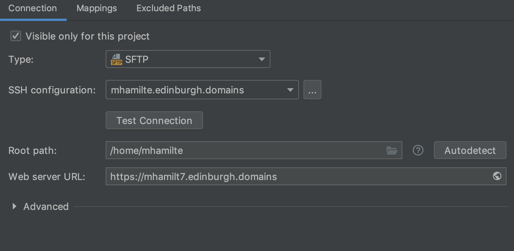

An easy way to edit your site directly is to connect via SSH File Transfer Protocol (SFTP). This guide covers how to upload files over SFTP with PHPStorm. You can approach this 2 ways.

-   **Method 1:** create a single _main_ project that will allow you to see your entire server
-   **Method 2:** create individual project per site your are working on.

* * *

### Create A New Project

* * *

### Set SFTP Server

-   Go to Preferences (or Settings)

    -   <i class="fa fa-apple" aria-hidden="true"></i>: <kbd>⌘</kbd> + <kbd>,</kbd>
    -   <i class="fa fa-windows" aria-hidden="true"></i>: <kbd>Ctrl</kbd> + <kbd>Alt</kbd> + <kbd>S</kbd>

-   `Build, Execution, Deployment` -> `Deployment`
-   Click the <kbd>+</kbd> icon to add a server.
    -   Select SFTP
    -   good idea to name it the same as your domain `your_domain.edinburgh.domains`
-   Next to SSH Configuration, click <kbd>...</kbd>
    -   click <kbd>+</kbd>
    -   Enter these details

| Field                | SFTP                            |
| -------------------- | ------------------------------- |
| Host                 | `your_domain.edinburgh.domains` |
| port                 | `22`                            |
| User Name            | **DOMAIN_USERNAME**†            |
| Authentication type: | Password                        |
| Root Path            | **DOMAIN_PASSWORD**†            |

* * *

**†** Your Domain Username and Password should have been provdied in your sign-up email. You can change your password in at <https://edinburgh.domains/user-information/> (sign-in required)

### Test Connection

-   Click Test Connection
    -   This should be successful. See Troubleshooting if there is an error.
-   Click autodetect next to Root Path. This should be `/home/DOMAIN_USERNAME`
-   Web Server url: `https://YOUR_DOMAIN.edinburgh.domains`
    -   click the globe icon to test this resolves correctly

* * *

### Map a Folder

-   Still in `Build, Execution, Deployment` -> `Deployment`, go to Mappings tab

#### Method 1:

-   Deployment Path: `/public_html`
-   Web Path: `/`

#### Method 2:

-   Deployment Path: click folder icon
    -   naviagte to `/public_html`
    -   right-click
    -   create new Directory name it `fatfree`
-   Web Path: `/fatfree/FFF-SimpleExample`

* * *

### Download from Server

-   Right Click your project folder
-   Navigate to `Deployment` -> `Download from your_domain.edinburgh.domains`

### Upload to server

-   Copy the contents of the [example project]({{site.url}}/example-projects-downloads) into your PHPStorm project

#### Manual Upload

To upload files manually:

-   Right click the project folder
-   `Deployment` -> `Upload to YOUR_DOMAIN.edinburgh.domains`

#### Automatic Upload

You can also set the project to automatically upload every time you save.

-   In `Build, Execution, Deployment` -> `Deployment`
-   Click the disclosure triangle and select `Options`
-   For `Upload changed files automatically to the default server` select `on explicit action`

