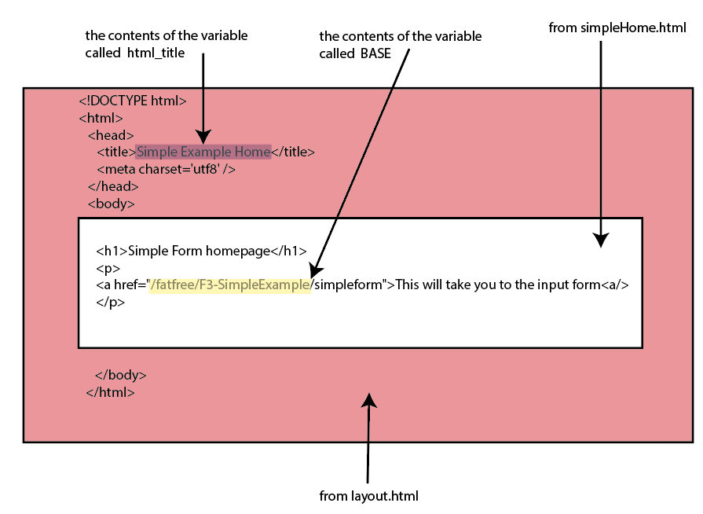
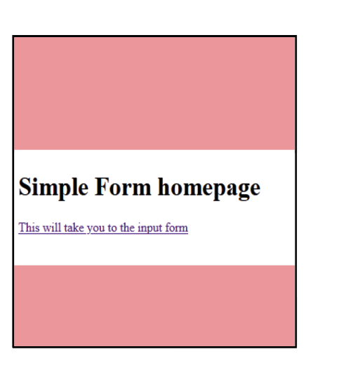
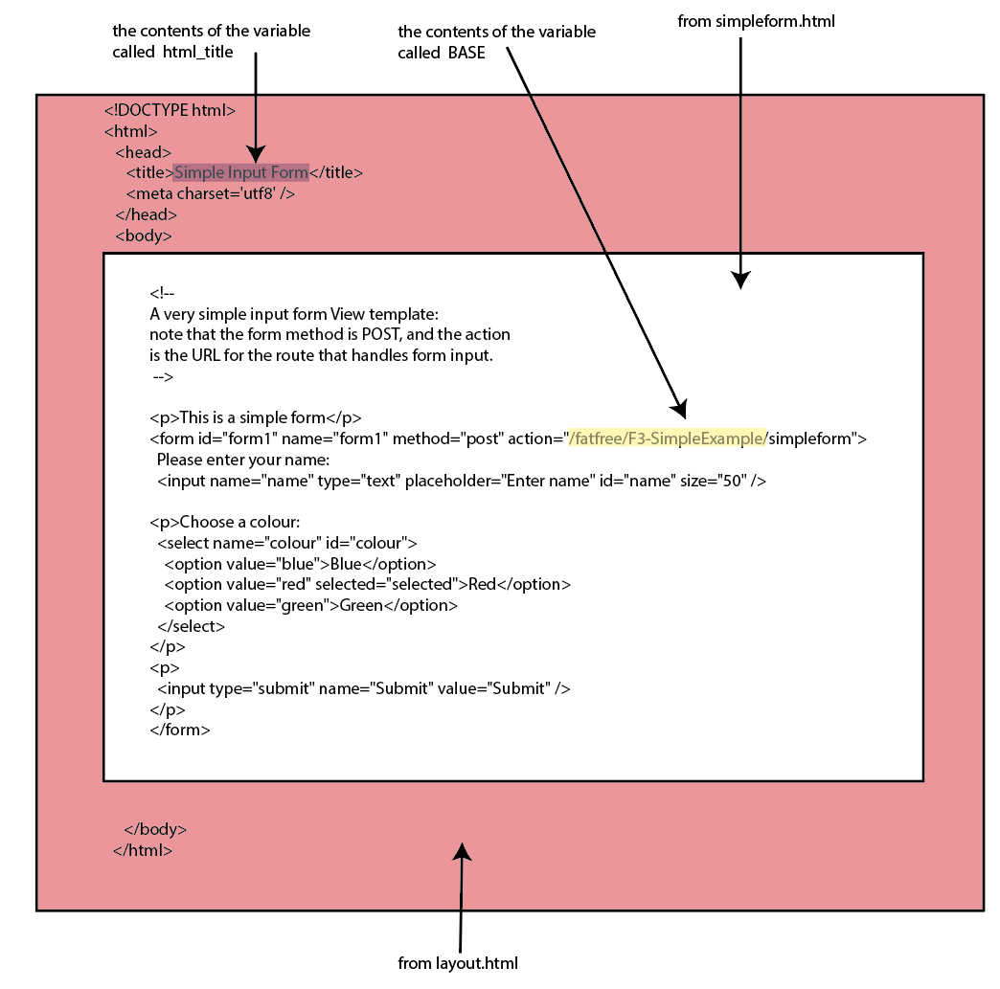
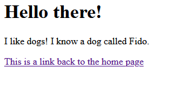
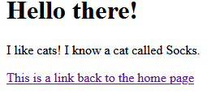
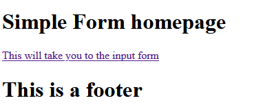

# Taking F3-SimpleExample and modifying it to create my own web-application

The files provided for the FFF-SimpleExample holds a large number of the
concepts you need to create your own website -- you can use this as a
basis for creating your own webpages.

Before you can start modifying the example, it helps to really
understand what it is doing.

When you go to the front page of your site -- in this case it would be
`https://<yourdomainname>.edinburgh.domains/fatfree/F3-SimpleExample/`
the browser first looks for an index.html page (which does not exist
because we're using php), and if it can't find it, it looks for
index.php -- which we have.

Index.php controls connecting to the database, how the requests form the
browser are dealt with and what gets displayed in the browser. In there,
each sub page of your site is defined with a function that the browser
routes the request to. This function then uses the code and templates
you have defined to build up the page to show to the user.

These routing statements look like this -- this is the routing for the
front page of the site (with the address '/'):

```php
$f3->route('GET /',

    function ($f3) {

        $f3->set('html_title', 'Simple Example Home');

        $f3->set('content', 'simpleHome.html');

        echo Template::instance()->render('layout.html');

    }

);
```

## Identifying the function being called in index.php

There are two pieces of information that identify which function is
being called. The first is the request type -- GET or POST, and the
second is the address (in relation to the base, or bottom directory of
your site).

A GET request is created if you click on a simple link to the page, or
by typing the address in the browser and pressing enter. A POST request
is usually generated from a form -- ie the webpage is doing something
and _posting_ data back to the site for you to do something with.

So, when you go to the front page of your site -

You have got there by typing the name and pressing enter (or by clicking
on a link), so this is a GET type request. As this is the front page of
my website, it looks for the file index.php, and looks for a routing
statement that has the following properties:

-   type: GET

-   address: / - this is means the top level page of your site, i.e. the
    front page.

So, the routing statement would be of the form:

```php
$f3->route('GET /',

    function ($f3) {

        //build the page

    }

);
```

The important part here is 'GET /' -- this is the way you got the page
(either GET or POST) and the address (in this case /). The line '//build
the page' is a comment -- i.e. it does nothing as it has '//' in front
of it.

Inside the function's curly brackets -- { and } -- the page is built up.
As these are single curly brackets they show the start and end point of
the block of code.

# Building the Page

In index.php beginning on line 28, you can see that there are three
lines that are used to build up the page that is shown:

```php
$f3->route('GET /',

    function ($f3) {

        $f3->set('html_title','Simple Example Home');

        $f3->set('content','simpleHome.html');

        echo Template::instance()->render('layout.html');

    }

);
```

It's easier to explain if you look at the three lines starting from the
last line.

Line 32:

```php
echo Template::instance()->render('layout.html');
```

uses the file layout.html to show what has been built up in the previous
two steps. The word 'echo' outputs on the screen the result of
'Template::instance()->render('layout.html');' -- the key part is the
name of the file 'layout.html' -- this is the template used for the
site.

## Structure of the Template

Looking at layout.html:

```html
<!DOCTYPE html>
<html>
<head>
    <title>{{ @html_title }}</title>
    <meta charset='utf8'/>
</head>
<body>
<include href="{{ @content }}"/>
</body>
</html>
```

This is the basic template for every page on your site - everything
passes through layout.html

Layout.html would be a great place to insert a menu bar (navigation) and
a footer i.e. things that you want to appear on every page of your site.
(see modifying the template)

layout.html has all the required elements for a web page. The parts in
between `<head>` and `</head>` are part of the page's set up; what is
between `<body>` and `</body>` is what is shown on the page. The text
that is between `<title>` and `</title>` is the text that is shown on
the tab of the browser.

This is static -- it will be the same for every page -- however, this
template has some part that change -- the variables, i.e. the parts of
the page that are dynamic. These parts are shown by using double curly
brackets -- `{{` and `}}` .

In layout.html there are two variables:

-   `{{ @html_title }}`

-   `{{ @content }}`

These variables have names with an @ sign before the name. This means we
can change what they contain from the code in index.php. These will be
replaced with text or numbers.

Line 8 in layout.html is a special line:

```html
<include href="{{ @content }}" />
```

It expects that the variable 'content' will be a file name -- F3 will
then replace the whole of this line with the contents of the filename
passed to it.

## Filling the variables

To show this page correctly, these two variables must be filled with
something.

Going back to index.php, line 30 says:

$f3->set('html_title','Simple Example Home');

What this says is when you see the variable called 'html_title',
replace it with the text 'Simple Example Home' -- this is what the
command 'set' does. So, when the code on line 32 is run, it looks at
layout.html, and sees there is a variable called 'html_title' and
replaces

```html
{{ @html_title }}
```

With

Simple Example Home.

Looking at line 32:

```php
$f3->set('content','simpleHome.html');
```

This has the same format as the previous line and replaces the variable
'content' with the file name simpleHome.html -- this variable must be a
file name as the way it is used in layout.html expects it to be a file
name.

So the variable:

```html
{{ @content }}
```

Is replaced with

```sh
simpleHome.html
```

And once the page is shown, the line (line 8 in layout.html after
filling in the variable)

```html
<include href="simpleHome.html" />
```

Will be replaced with

```html
<h1>Simple Form homepage</h1>

<p>

<a href="{{ @BASE }}/simpleform">This will take you to the input
form<a/>

</p>
```

Notice that in this file is _another_ variable --

```html
{{ @BASE }}
```

This is a variable that you don't need to set manually -- the code
automatically uses the file .htaccess to set the URL of the website --
ie the _base_ of the site. It uses the location of index.php to set this
\-- in the case of my site I have put the code in the folders
fatfree/F3-SimpleExample/, so it replaces

```html
{{ @BASE }}
```

With

```sh
/fatfree/F3-SimpleExample/
```

## Overall Page

When you look at the page source you can see how these have been
combined to create the page:

{width="6.268055555555556in"
height="4.579861111111111in"}

You can see the source by clicking 'Ctrl + Shift + C' in Firefox and
Chrome -- using the Development tools for your browser is a good way to
look at the html and CSS that have been built up to create your page.

This then is shown on the screen like this:

{width="2.75in"
height="3.0838484251968503in"}

Notice how the parts from layout.html are invisible, all you can see is
the words that were part of simpleHome.html. This is because the
original template is very simple and has nothing more than the very
basic details.

## Other Pages

The other pages are set up in a similar way. So, for example, clicking
on the link on the homepage, would take you to
<https://ksuther4.edinburgh.domains/fatfree/F3-SimpleExample/simpleform>
(on my site!). So, as it was a simple click on a simple link, this is a
GET request, and the address is `/simpleform` -- ie the URL above minus
the location of index.php which is at
<https://ksuther4.edinburgh.domains/fatfree/F3-SimpleExample>

This means that the code that will be run to show the page starts on
line 37 in index.php:

```php
$f3->route('GET /simpleform',

    function($f3) {

        $f3->set('html_title','Simple Input Form');

        $f3->set('content','simpleform.html');

        echo template::instance()->render('layout.html');

    }
);
```

This does exactly the same as the first page, except the title and the
contents fed into the template are different -- the title will be
'Simple Input Form' and the contents of the page will be what is in
simpleform.html giving this as the final page source:

{width="5.7690540244969375in"
height="5.708333333333333in"}

## Creating a Completely New Page

1 -- Creating the content.

Create a new html file in the ui directory - as an example, I'll call it
newPage.html

In this file put the html that you want to show, for example:

```html
<h1>Hello there!</h1>
<p>
    I like {{ @animalType }}s! I know a {{ @animalType }} called {{
    @animalName }}.
</p>
<p>
    <a href="{{ @BASE }}/">This is a link back to the home page</a>
</p>
```

Note you can use the same variable more than once on a page and it will
be replaced with the same value each time.

2.  Create the routing

Add the following code to index.php at line 97 (ie before the line that
has $f3->run()

```php
$f3->route('GET /dogfan',

    function ($f3) {

        $f3->set('html_title','New Page');

        $f3->set('animalType','dog');

        $f3->set('animalName','Fido');

        $f3->set('content','newPage.html');

        echo Template::instance()->render('layout.html');

    }

);
```

As two variables were created in newPage.html, I had to use the set
command twice to fill them.

This will then show your new page when you go to `<your domain>/fatfree/F3-SimpleExample/dogfan`

{width="3.0725328083989503in"
height="1.531058617672791in"}

## Reusing an existing page

You can reuse pages that you have already created to show different content just by changing the content of the variables.

For example, assuming you created the page in the steps above, add the following to index.php

```php
$f3->route('GET /dogfan',

    function ($f3) {

        $f3->set('html_title','New Page');

        $f3->set('animalType','dog');

        $f3->set('animalName','Fido');

        $f3->set('content','newPage.html');

        echo Template::instance()->render('layout.html');

    }

);
```

This reuses the NewPage.html but puts in different values so you see the following:

{width="2.874640201224847in"
height="1.2706747594050745in"}

## Modifying the template

You may wish to do this if you want something to show up on every page of your site.

To add a footer, for example, there are two steps you would take.

First, you would create a file called footer.html and put the code you
want shown on every page -- for example:

```html
<h1>This is a footer</h1>
```

Then, in layout.html you would add in the following where you want the
footer to show up:

```html
<include href="footer.html" />
```

So, my layout.html would look like:

```html
<!DOCTYPE html>
<html>
<head>
    <title>{{ @html_title }}</title>
    <meta charset='utf8' />
</head>
<body>
<include href="{{ @content }}" />
<include href="footer.html" />
</body>
</html>
```

This would mean that whatever you have put in footer.html would show up
after the page content that has been created in the filename in the
variable 'content' -- so for my example the front page would look like:

{width="3.84326990376203in"
height="1.5935509623797026in"}

This is just an example, you can use this idea to create the navigation
menu for the site and/or a header.
